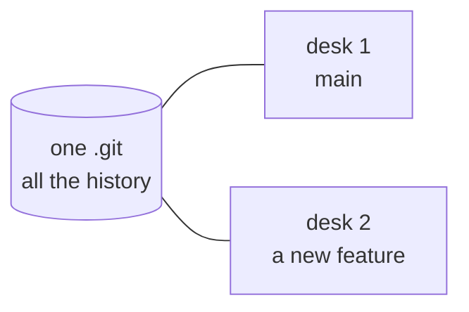

# Explain Visually

Re-render the immediately preceding assistant reply — or a named topic — as the smallest visual that makes the point land, at the depth the reader needs.

---

## 1. PURPOSE

The `/rewrite:explain-visually` command turns an explanation into a picture instead of more prose.

- Chooses a **modality**: the smallest visual form that answers the current question.
- Chooses a **depth**: how much prior knowledge to assume, from peer-level down to none.
- Operates entirely in-context using the executing model's reasoning capacity. No local or external LLM provider, CLI dispatch, or background service is invoked.
- Renders where the reader can actually see it. A diagram published as a page is a diagram; the same diagram as fenced source in a terminal is a wall of text that fails the one job this command has. So the default is a published visual, and `--inline` is the opt-out for something small enough to read as source.
- Creates only new material: canonical transcript history and existing project files stay unchanged either way.
- Preserves technical accuracy and reproduces protected tokens byte-for-byte.

It belongs to the `/rewrite` family because, with no topic argument, it re-renders the prior reply — the same act as `/rewrite:response`, choosing a diagram rather than plainer wording.

---

## 2. CONTRACT

**Inputs:** `$ARGUMENTS` — optional `--depth=expert|plain|novice`, optional `--inline`, optional free-text `topic`.

**Outputs:** A published visual page and its link, or an in-reply rendering under `--inline`, followed by a structured status line.

| Output Status                                     | Condition                                                        |
| --------------------------------------------------| ------------------------------------------------------------------|
| `STATUS=OK ARTIFACT="<url>"`                      | Visual published as a page and the reader was given its link     |
| `STATUS=OK ARTIFACT="<path>"`                     | Published as a file because this runtime has no publish surface  |
| `STATUS=OK INLINE=1`                              | Rendered in the reply, because `--inline` was passed             |
| `STATUS=NOOP REASON="no prior assistant message"` | No topic given and no previous assistant turn exists             |
| `STATUS=NOOP REASON="nothing visual to show"`     | Subject is a plain factual answer no diagram would clarify       |
| `STATUS=FAIL ERROR="<message>"`                   | Invalid arguments or unrecoverable error                         |

---

## 3. INSTRUCTIONS

Execute the following steps in order:

### Step 1: Parse Arguments

- Read `--depth=<level>`; accept `expert`, `plain`, `novice`. Default to `expert` when absent.
- Read `--inline` as a boolean; default false. Publishing is the default.
- Treat all remaining non-flag text as the `topic`.
- If `--depth` carries an unrecognized value, return `STATUS=FAIL ERROR="unknown depth"`.
- If an unknown flag is present, return `STATUS=FAIL ERROR="unknown flag"`.

### Step 2: Resolve The Subject

- If `topic` is non-empty, the subject is that topic.
- If `topic` is empty, the subject is the immediately preceding assistant message.
- If `topic` is empty and no previous assistant message exists:
  - Emit notice: `No prior assistant message found to explain.`
  - Return `STATUS=NOOP REASON="no prior assistant message"` and terminate.
- When the subject names code, a file, or a symbol, read it before drawing it. Never diagram a structure inferred from its name.

### Step 3: Select The Modality

Pick the **smallest** form that answers the question being asked. Match the form to the content:

| Content being explained | Form |
|---|---|
| Logic, algorithms, decision rules | Pseudocode |
| Runtime control flow, who calls whom | Call tree |
| UI structure, state and module boundaries | Component tree |
| Responsibility layout, refactor targets | File tree |
| Interaction, sequence, data flow, state machines | Mermaid |
| What changes between two states | `diff` block |
| Mostly-new code, or where exact syntax matters | Code block |
| Dense comparison, layout, or many related values | HTML (see Step 6) |

- Include only what resolves the current question. Omit files, props, states, branches, and boundaries that do not.
- If no visual would clarify the subject — a one-line factual answer, for instance — say so plainly and return `STATUS=NOOP REASON="nothing visual to show"`.

### Step 4: Apply The Depth Rubric

- **`expert`** (default): assume a peer. Use real identifiers and precise terms. Skip basics.
- **`plain`**: assume an intelligent non-specialist. Expand each piece of jargon once, at first use. Keep real names, and add a plain gloss beside them.
- **`novice`**: assume no background at all. Lead with the picture; keep text sparse and concrete. Prefer a familiar analogy over a precise term, and label parts with everyday words. Never let simplification make a claim that is false.

### Step 5: Identify Protected Spans

When any part of the subject is reproduced rather than newly written, these stay byte-for-byte identical:

- Fenced code blocks and inline code
- File paths, directory paths, and extensions
- Terminal commands, scripts, and flags
- URLs, URIs, endpoints, and protocol strings
- Exact numbers, dates, timestamps, and metric values
- Identifiers: variables, functions, classes, parameters, config keys

Simplification applies to prose only. It never rewrites a value.

### Step 6: Render

- Place the visual first, with at most a short line of prose before it, and put any supporting text directly beside the part it explains.

**By default, publish it.**

- Write one self-contained HTML page: the visual, and the supporting text beside the parts it explains.
- Inline every style. Reference no external asset. A page that needs the network is a page that breaks.
- Publish it through whatever surface this runtime exposes for rendered pages, and give the reader the
  link. Mermaid renders natively in a published page, so a ```mermaid block inside the HTML is a
  diagram rather than source.
- Do not modify any existing file to do this; the page is new material.
- Where the runtime has no publish surface, write the file, name its path, and say plainly that it is
  a file rather than a link. Do not silently fall back to fenced source: the reader asked for a visual.
- Put only the link and one line of summary in the reply. The page carries the explanation.

**With `--inline`, render it in the reply instead.**

- Mermaid in a ```mermaid fenced block; trees and pseudocode in plain fenced blocks.
- Use this for something small enough to read as source, or when the reader asked for it. Be aware
  that in most terminals a fenced Mermaid block displays as its own source text, not as a picture.

- Emit the status line last.

---

## 4. EXAMPLES

### Example 1: Explain The Prior Reply, Default Depth

```text
/rewrite:explain-visually
```

Output:

```text
The reply described a three-stage dispatch. As a call tree:

dispatchLineage()
├── validateExecutorKind()      throws on unknown kind
├── resolveModel()              allowlist check
└── runAuditedCommand()
    ├── writeIntentReceipt()
    └── writeCompletionReceipt()

STATUS=OK
```

### Example 2: A Topic, Explained From Zero

```text
/rewrite:explain-visually --depth=novice how does a git worktree work
```

Output:

```text
One box of history, several desks to work at.



Each desk has its own files you can edit. They all share one box of history,
so a commit made at any desk goes into the same box.

STATUS=OK
```

### Example 3: Nothing Worth Drawing

```text
/rewrite:explain-visually what port does the daemon use
```

Output:

```text
That is a single value, not a structure — a diagram would not add anything.
The daemon listens on port 4096.

STATUS=NOOP REASON="nothing visual to show"
```

---

## 5. NOTES

- **In-Context Execution:** The active model produces the explanation within the existing conversation. No external API or local model process is invoked, so the projection lane's enablement flag and egress rules do not apply to this command.
- **New Material Only:** The command creates a page or a reply and never rewrites canonical transcript records or existing source files. Publishing by default changes where the visual goes, not what it is allowed to touch.
- **Smallest Sufficient Visual:** A diagram that shows everything explains nothing. Cut every node that does not help answer the question actually asked.
- **Simplify The Words, Never The Facts:** Depth changes vocabulary and framing. It never changes a value, an identifier, or a claim.
