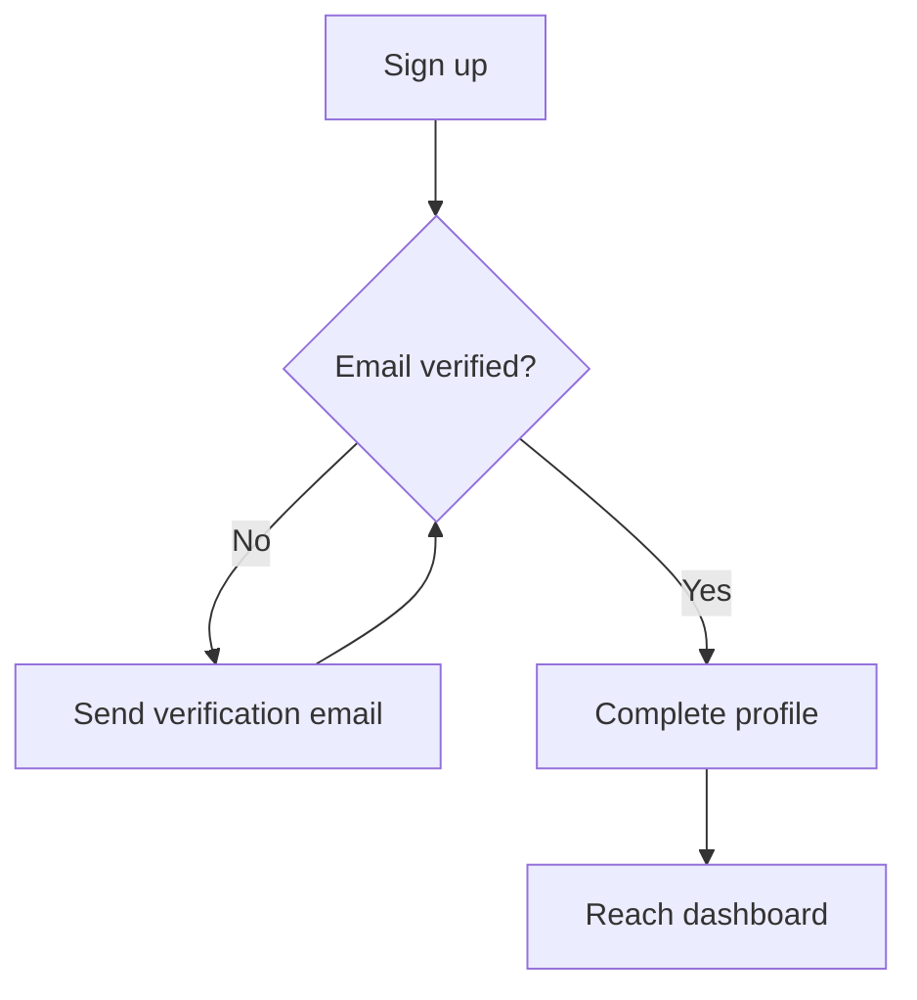

# Onboarding Flow

New users go through a short verification loop before reaching the dashboard.

```mermaid
flowchart TD
    A[Sign up] --> B{Email verified?}
    B -->|No| C[Send verification email]
    C --> B
    B -->|Yes| D[Complete profile]
    D --> E[Reach dashboard]
```

The flow above is intentionally short — every extra step measurably drops completion.
