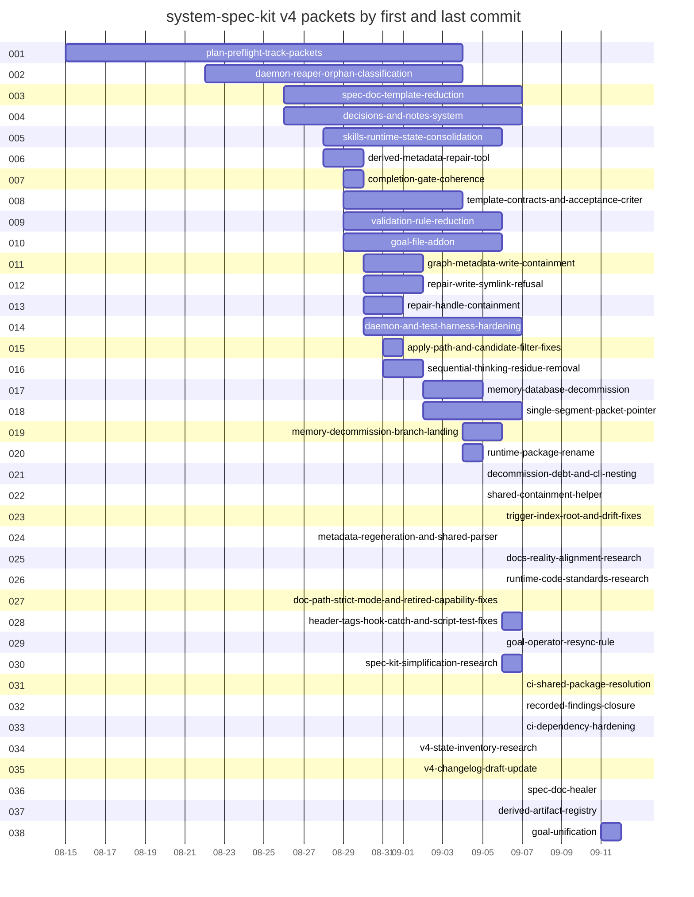

# Timeline: system-speckit-v4

<!-- SPECKIT_TEMPLATE_SOURCE: timeline | v2.2 -->
<!-- HVR_REFERENCE: .opencode/skills/sk-doc/sk-create-with-human-voice/references/hvr-rules.md -->

> The order in which the thirty-eight v4 packets were started and finished, taken from git.

---

<!-- ANCHOR:metadata -->
## 1. METADATA

**Subject:** system-spec-kit v4, children 001 to 038 of this parent
**Status:** Complete
**Started:** 2026-08-15
**Last updated:** 2026-09-12
**Owner:** the spec-kit maintainers; regenerated from `git log` over each packet's current and former paths, excluding the bulk housekeeping commits from 2026-09-06 onward that touch five or more children (consolidation moves, repoints, metadata and provenance sweeps); nothing hand-typed
<!-- /ANCHOR:metadata -->

---

<!-- ANCHOR:timeline -->
## 2. TIMELINE

Each entry is a packet's first commit. The outcome names what the packet left behind and when its last commit landed.

**2026-08-15:** `001-plan-preflight-track-packets` (was `034-plan-preflight-nested-packet-resolution`) started; 5 commits over 0 nested phases. Outcome: The /speckit:plan Step-5 prerequisite helper resolves the feature dir from the git branch and hard-rejects any non-NNN branch, so it cannot target a track-nested packet such as specs/anobel.com/008-di. Status Complete; last commit 2026-09-04.

**2026-08-22:** `002-daemon-reaper-orphan-classification` (was `035-process-reaper-classification-fix`) started; 6 commits over 0 nested phases. Outcome: The daemon-reaper misclassifies an orphaned spec-memory server as an external MCP process because its external-MCP guard matches the mcp-server/ directory in the daemon's own path. Status Complete; last commit 2026-09-04.

**2026-08-26:** `003-spec-doc-template-reduction` (was `036-spec-doc-template-reduction`) started; 27 commits over 13 nested phases. Outcome: Phase parent for Reduce and optimize spec-kit doc templates; merge tasks and checklist; less bloat, better historic context and small-model legibility. Status Draft; last commit 2026-09-07.

**2026-08-26:** `004-decisions-and-notes-system` (was `037-decisions-memory-redesign`) started; 17 commits over 6 nested phases. Outcome: Phase parent for Deprecate constitutional memory; build a separate actively-used decisions and notes system integrated with spec and skill. Status Draft; last commit 2026-09-07.

**2026-08-28:** `005-skills-runtime-state-consolidation` (was `038-skills-state-consolidation`) started; 4 commits over 0 nested phases. Outcome: Seven runtime-state directories sit directly under .opencode/skills/, so the folder a user opens to find skills shows mostly machine state instead. Status Complete; last commit 2026-09-06.

**2026-08-28:** `006-derived-metadata-repair-tool` (was `039-derived-repair-automation`) started; 7 commits over 0 nested phases. Outcome: Repair the spec-packet validation failures that are recomputable from repository state, and refuse the ones that record work a person did. Status In Progress; last commit 2026-08-30.

**2026-08-29:** `007-completion-gate-coherence` (was `040-validation-gate-coherence`) started; 7 commits over 0 nested phases. Outcome: Make the completion gate return the same verdict whatever the environment, stop counting one fault several times, and remove the checks a packet cannot satisfy from inside itself. Status Complete; last commit 2026-08-30.

**2026-08-29:** `008-template-contracts-and-acceptance-criteria` (was `033-spec-kit-template-optimization`) started; 21 commits over 4 nested phases. Outcome: Phase parent for spec-kit document-template optimization: level-gated template contracts, context-cost reduction, and a canonical acceptance-criteria document that gates packet closure at Levels 2, 3 . Status In Progress; last commit 2026-09-04.

**2026-08-29:** `009-validation-rule-reduction` (was `041-validation-reduction`) started; 17 commits over 8 nested phases. Outcome: Reduce the completion gate to the few checks a machine actually reads, and make the rest impossible to violate rather than detected afterwards. Status Complete; last commit 2026-09-06.

**2026-08-29:** `010-goal-file-addon` (was `042-nested-goal-template-addon`) started; 13 commits over 4 nested phases. Outcome: Phase parent for a goal.md addon: a short durable parent directive that references per-phase child goal files, entering the Level contract as a lazy add-on and reaching the speckit command surface run. Status In Progress; last commit 2026-09-06.

**2026-08-30:** `011-graph-metadata-write-containment` (was `043-workspace-path-containment`) started; 4 commits over 0 nested phases. Outcome: The graph-metadata write guard classified a destination as spec-shaped and wrote it, so any path containing a specs segment was accepted - including one outside the repository. Status Complete; last commit 2026-09-02.

**2026-08-30:** `012-repair-write-symlink-refusal` (was `044-repair-write-symlink-refusal`) started; 5 commits over 0 nested phases. Outcome: The repair script decided a path was a regular file during its scan and wrote it later. Status Complete; last commit 2026-09-02.

**2026-08-30:** `013-repair-handle-containment` (was `046-path-containment-followups`) started; 4 commits over 0 nested phases. Outcome: The repair write decides a path is safe by inspecting it, then writes through a handle that can point somewhere else: swapping a scanned directory for a symlink overwrites a file outside the tree. Status Complete; last commit 2026-09-01.

**2026-08-30:** `014-daemon-and-test-harness-hardening` (was `045-daemon-and-test-harness-hardening`) started; 11 commits over 4 nested phases. Outcome: Phase parent for four production-observed failure classes in daemon supervision and the vitest harness, each traced to a safety mechanism that exists and is correct but is never reached at runtime. Status Complete; last commit 2026-09-07.

**2026-08-31:** `015-apply-path-and-candidate-filter-fixes` (was `047-review-remediation`) started; 5 commits over 0 nested phases. Outcome: Three P1 findings survived four deep-review iterations across three models: an apply path that treated an omitted enable decision as permission, a candidate filter that judged from a stale snapshot, a. Status Complete; last commit 2026-09-01.

**2026-08-31:** `016-sequential-thinking-residue-removal` (was `048-decommissioned-server-residue`) started; 2 commits over 0 nested phases. Outcome: The doctor command family still probes, reports on, and offers to reinstall the Sequential Thinking MCP server that was decommissioned in commit edff3a4c161, and specs/sk-doc carries an empty false-st. Status Complete; last commit 2026-09-02.

**2026-09-02:** `017-memory-database-decommission` (was `049-memory-decommission`) started; 19 commits over 7 nested phases. Outcome: Phase parent for removing the system-spec-memory MCP database subsystem and replacing it with grep-first retrieval. Status Complete; last commit 2026-09-05.

**2026-09-02:** `018-single-segment-packet-pointer` (was `050-single-segment-packet-pointer`) started; 2 commits over 0 nested phases. Outcome: Let SPECDOC_FRONTMATTER_004 accept a single safe path segment in packet_pointer instead of demanding a track/name pair, so a repository that keeps packets directly under specs/ can pass. Status Draft; last commit 2026-09-07.

**2026-09-04:** `019-memory-decommission-branch-landing` (was `052-memory-decommission-landing`) started; 47 commits over 0 nested phases. Outcome: The memory-database decommission existed only on a side branch while the release branch and main still carried the memory server, its hooks and its commands; this packet lands the branch, aligns the c. Status Complete; last commit 2026-09-06.

**2026-09-04:** `020-runtime-package-rename` (was `053-spec-kit-runtime-rename`) started; 9 commits over 0 nested phases. Outcome: The surviving spec-kit package still carries an MCP identity it no longer has: folder and npm name say mcp-server, the MCP SDK and six other dependencies have no importer, and about 140 live files poi. Status Complete; last commit 2026-09-05.

**2026-09-05:** `021-decommission-debt-and-cli-nesting` (was `054-decommission-debt-fixes`) started; 40 commits over 7 nested phases. Outcome: Close the debt the memory-decommission review loop recorded, move the trigger index under runtime, and align the runtime and scripts packages with the OpenCode code standards and code-folder README co. Status Complete; last commit 2026-09-05.

**2026-09-05:** `022-shared-containment-helper` (was `055-path-containment-seam`) started; 1 commit over 0 nested phases. Outcome: The CLI checked write boundaries three different ways: lexically in the changelog generator, realpath-only in the description generator, and canonically in the shared utilities. Status Complete; last commit 2026-09-05.

**2026-09-06:** `023-trigger-index-root-and-drift-fixes` (was `056-integration-research-remediation`) started; 4 commits over 4 nested phases. Outcome: Phase parent for remediating the eleven findings of the Sonnet 5 integration research: the trigger-index root regression and README rule count, phantom children and unvalidated track roots, the deferr. Status Complete; last commit 2026-09-06.

**2026-09-06:** `024-metadata-regeneration-and-shared-parser` (was `057-metadata-regeneration-and-parser-edges`) started; 3 commits over 0 nested phases. Outcome: Run the identity-aware metadata writer over every drifted packet that is clean in git, give system-deep-loop and sk-doc a dependency edge to the spec-kit shared package, and adopt the shared frontmatt. Status Complete; last commit 2026-09-06.

**2026-09-06:** `025-docs-reality-alignment-research` started; 6 commits over 0 nested phases. Outcome: A ten-iteration DeepSeek V4 Flash lane on the pi CLI checked the playbook, catalog and references against the runtime; seventeen mismatches reported, fourteen reproduced; a two-iteration Gemini 3.8 Flash pass added nineteen more, eighteen reproduced; a five-iteration DeepSeek pass added eleven more plus a twenty-file phantom-test sweep; a Claude Fable 5 verification confirmed the fixes and found fourteen residue sites. Status Complete; last commit 2026-09-06.

**2026-09-06:** `026-runtime-code-standards-research` started; 7 commits over 0 nested phases. Outcome: A parallel ten-iteration lane audited the shared package and runtime against the sk-code standards; eighteen deviations reported, twelve confirmed, four dropped with evidence; a two-iteration Gemini 3.8 Flash pass added sixteen more, all reproduced, including the misplaced telemetry store; a five-iteration DeepSeek pass added eleven more, all reproduced; a Claude Fable 5 verification repaired the dead CLI check gate and gave the telemetry store its writer. Status Complete; last commit 2026-09-06.

**2026-09-06:** `027-doc-path-strict-mode-and-retired-capability-fixes` started; 4 commits over 0 nested phases. Outcome: The fourteen confirmed doc mismatches plus eighteen from the Gemini pass fixed at their cited lines, plus same-class sites; strict mode, moved paths, phantom rules and retired capabilities now match the runtime. Status Complete; last commit 2026-09-06.

**2026-09-06:** `028-header-tags-hook-catch-and-script-test-fixes` started; 7 commits over 0 nested phases. Outcome: Header tags normalized, silent hook catches made to report, dead modules and migrations removed, scripts and the API given tests, the completeness errexit bug fixed, and the shared config root bug that lost phase parents' active-child pointers fixed with the classifier taught to read the store. Status Complete; last commit 2026-09-07.

**2026-09-06:** `029-goal-operator-resync-rule` (was `034-goal-operator-resync-rule`) started; 1 commit over 0 nested phases. Outcome: The goal addon template and its playbook carry one rule - when anything above the log changes, resend the full parent goal.md in chat - so the operator's session objective never drifts from the file. Status Complete; last commit 2026-09-06.

**2026-09-06:** `030-spec-kit-simplification-research` (was `035-spec-kit-simplification-research`) started; 36 commits over 22 nested phases. Outcome: Three research rounds over the spec-kit surface, from the ripgrep search system and CLI runtime utilization through overengineering, template contracts and doctor signal truth, each lane remediated in its own child. Status Complete; last commit 2026-09-07.

**2026-09-07:** `031-ci-shared-package-resolution` (was `029-ci-shared-package-resolution`) started; 3 commits over 0 nested phases. Outcome: The four workflows red since the shared-parser adoption fixed: the install step, the tracked declaration, one link, and the regenerated mirrors. Status Complete; last commit 2026-09-07.

**2026-09-07:** `032-recorded-findings-closure` (was `036-recorded-findings-closure`) started; 20 commits over 16 nested phases. Outcome: Every finding the simplification program recorded rather than fixed closed, one phase per cluster, plus the operator items it left open. Status Complete; last commit 2026-09-07.

**2026-09-07:** `033-ci-dependency-hardening` (was `037-ci-dependency-hardening`) started; 1 commit over 0 nested phases. Outcome: The pre-commit hook runs the same six mirror checks CI runs, the Spec-Kit Check workflow triggers on every mirror source and output, and the forty-four open Dependabot alerts reach zero. Status Complete; last commit 2026-09-07.

**2026-09-08:** `034-v4-state-inventory-research` started; 0 commits over 0 nested phases. Outcome: Two ten-iteration lanes, GPT-5.6 Luna on codex and DeepSeek V4 Flash on devin, inventory what the repository ships and rank every stale claim in the old v4 changelog draft; nineteen drift rows ranked, seventeen reproduced, three lane findings dropped. Status Complete; last commit 2026-09-08.

**2026-09-08:** `035-v4-changelog-draft-update` started; 0 commits over 0 nested phases. Outcome: The v4.0.0.0 changelog draft corrected at every confirmed drift row and extended with the memory decommission, runtime rename, completion-gate, simplification, closure and CI work it predated. Status Complete; last commit 2026-09-08.

**2026-09-11:** `036-spec-doc-healer` (was `034-spec-doc-healer`) started; 1 commit over 0 nested phases. Outcome: The healer restores the required frontmatter fields 323 spec documents lost, nearly always an emptied trigger_phrases list, and refuses what it cannot justify, so the retrieval index fills again. Status Complete; last commit 2026-09-11.

**2026-09-11:** `037-derived-artifact-registry` (was `035-derived-artifact-registry`) started; 1 commit over 3 nested phases. Outcome: One registry for every derived artifact, planned in three phases. Nothing built yet. Status Draft; last commit 2026-09-11.

**2026-09-11:** `038-goal-unification` (was `036-goal-unification`) started; 6 commits over 12 nested phases. Outcome: The packet goal.md became the single goal source for every runtime: goal-core reads and writes it, the goal hook and the speckit commands keep it current and resend the stripped slice, and the legacy store was demoted to a session index. Four follow-up phases then closed the last open decisions, researched what the remediation left open and had the recommendations contested by a second model family. Status Complete; last commit 2026-09-12.

### Chronology table

| # | Slot | Old id | First | Last | Commits | Nested | Status |
|---|------|--------|-------|------|---------|--------|--------|
| 1 | `001-plan-preflight-track-packets` | `034-plan-preflight-nested-packet-resolution` | 2026-08-15 | 2026-09-04 | 8 | 0 | Complete |
| 2 | `002-daemon-reaper-orphan-classification` | `035-process-reaper-classification-fix` | 2026-08-22 | 2026-09-04 | 9 | 0 | Complete |
| 3 | `003-spec-doc-template-reduction` | `036-spec-doc-template-reduction` | 2026-08-26 | 2026-09-06 | 28 | 13 | Draft |
| 4 | `004-decisions-and-notes-system` | `037-decisions-memory-redesign` | 2026-08-26 | 2026-09-04 | 15 | 6 | Draft |
| 5 | `005-skills-runtime-state-consolidation` | `038-skills-state-consolidation` | 2026-08-28 | 2026-08-30 | 6 | 0 | Complete |
| 6 | `006-derived-metadata-repair-tool` | `039-derived-repair-automation` | 2026-08-28 | 2026-08-30 | 10 | 0 | In Progress |
| 7 | `007-completion-gate-coherence` | `040-validation-gate-coherence` | 2026-08-29 | 2026-08-30 | 10 | 0 | Complete |
| 8 | `008-template-contracts-and-acceptance-criteria` | `033-spec-kit-template-optimization` | 2026-08-29 | 2026-09-04 | 24 | 4 | In Progress |
| 9 | `009-validation-rule-reduction` | `041-validation-reduction` | 2026-08-29 | 2026-09-01 | 19 | 8 | Complete |
| 10 | `010-goal-file-addon` | `042-nested-goal-template-addon` | 2026-08-29 | 2026-09-04 | 15 | 4 | In Progress |
| 11 | `011-graph-metadata-write-containment` | `043-workspace-path-containment` | 2026-08-30 | 2026-09-02 | 7 | 0 | Complete |
| 12 | `012-repair-write-symlink-refusal` | `044-repair-write-symlink-refusal` | 2026-08-30 | 2026-09-02 | 8 | 0 | Complete |
| 13 | `013-repair-handle-containment` | `046-path-containment-followups` | 2026-08-30 | 2026-09-01 | 7 | 0 | Complete |
| 14 | `014-daemon-and-test-harness-hardening` | `045-daemon-and-test-harness-hardening` | 2026-08-30 | 2026-09-04 | 12 | 4 | Complete |
| 15 | `015-apply-path-and-candidate-filter-fixes` | `047-review-remediation` | 2026-08-31 | 2026-09-01 | 8 | 0 | Complete |
| 16 | `016-sequential-thinking-residue-removal` | `048-decommissioned-server-residue` | 2026-08-31 | 2026-09-02 | 5 | 0 | Complete |
| 17 | `017-memory-database-decommission` | `049-memory-decommission` | 2026-09-02 | 2026-09-05 | 22 | 7 | Complete |
| 18 | `018-single-segment-packet-pointer` | `050-single-segment-packet-pointer` | 2026-09-02 | 2026-09-02 | 4 | 0 | Draft |
| 19 | `019-memory-decommission-branch-landing` | `052-memory-decommission-landing` | 2026-09-04 | 2026-09-06 | 49 | 0 | Complete |
| 20 | `020-runtime-package-rename` | `053-spec-kit-runtime-rename` | 2026-09-04 | 2026-09-05 | 12 | 0 | Complete |
| 21 | `021-decommission-debt-and-cli-nesting` | `054-decommission-debt-fixes` | 2026-09-05 | 2026-09-05 | 43 | 7 | Complete |
| 22 | `022-shared-containment-helper` | `055-path-containment-seam` | 2026-09-05 | 2026-09-05 | 4 | 0 | Complete |
| 23 | `023-trigger-index-root-and-drift-fixes` | `056-integration-research-remediation` | 2026-09-06 | 2026-09-06 | 7 | 4 | Complete |
| 24 | `024-metadata-regeneration-and-shared-parser` | `057-metadata-regeneration-and-parser-edges` | 2026-09-06 | 2026-09-06 | 5 | 0 | Complete |
| 25 | `025-docs-reality-alignment-research` | none | 2026-09-06 | 2026-09-06 | 1 | 0 | Complete |
| 26 | `026-runtime-code-standards-research` | none | 2026-09-06 | 2026-09-06 | 1 | 0 | Complete |
| 27 | `027-doc-path-strict-mode-and-retired-capability-fixes` | none | 2026-09-06 | 2026-09-06 | 1 | 0 | Complete |
| 28 | `028-header-tags-hook-catch-and-script-test-fixes` | none | 2026-09-06 | 2026-09-06 | 1 | 0 | Complete |
| 29 | `029-goal-operator-resync-rule` | `034-goal-operator-resync-rule` | 2026-09-06 | 2026-09-06 | 4 | 0 | Complete |
| 30 | `030-spec-kit-simplification-research` | `035-spec-kit-simplification-research` | 2026-09-06 | 2026-09-07 | 40 | 22 | Complete |
| 31 | `031-ci-shared-package-resolution` | `029-ci-shared-package-resolution` | 2026-09-07 | 2026-09-07 | 4 | 0 | Complete |
| 32 | `032-recorded-findings-closure` | `036-recorded-findings-closure` | 2026-09-07 | 2026-09-07 | 24 | 16 | Complete |
| 33 | `033-ci-dependency-hardening` | `037-ci-dependency-hardening` | 2026-09-07 | 2026-09-07 | 5 | 0 | Complete |
| 34 | `034-v4-state-inventory-research` | none | 2026-09-08 | 2026-09-08 | 5 | 0 | Complete |
| 35 | `035-v4-changelog-draft-update` | none | 2026-09-08 | 2026-09-08 | 7 | 0 | Complete |
| 36 | `036-spec-doc-healer` | `034-spec-doc-healer` | 2026-09-11 | 2026-09-11 | 1 | 0 | Complete |
| 37 | `037-derived-artifact-registry` | `035-derived-artifact-registry` | 2026-09-11 | 2026-09-11 | 1 | 3 | Draft |
| 38 | `038-goal-unification` | `036-goal-unification` | 2026-09-11 | 2026-09-12 | 7 | 12 | Complete |

### Gantt

### Key commits

Up to five per packet, the earliest and the latest, excluding the consolidation moves.

**1. 001-plan-preflight-track-packets**

- `5e5721ed24` 2026-08-15 fix(speckit-preflight): honor explicit SPECIFY_FEATURE for nested packets
- `3f6242a924` 2026-08-29 fix(graph): trust declared key files, and repair the packets the layout bug degraded
- `52946a6f66` 2026-08-30 fix(system-speckit): make the drift gate compare every packet that carries a digest
- `2f58acfb6e` 2026-09-04 docs(specs): retrofit the grep convention across the active spec corpus

**2. 002-daemon-reaper-orphan-classification**

- `66abf03b05` 2026-08-22 fix(spec-kit): correct reaper external-MCP classification for daemons under mcp-server/
- `291f609872` 2026-08-29 fix(specs): give every checklist the title its template asks for
- `b5823f8a26` 2026-08-29 fix(graph): resolve repo-relative key files again, and restore what was dropped
- `2f58acfb6e` 2026-09-04 docs(specs): retrofit the grep convention across the active spec corpus
- `52946a6f66` 2026-08-30 fix(system-speckit): make the drift gate compare every packet that carries a digest

**3. 003-spec-doc-template-reduction**

- `4dec059bcd` 2026-08-26 docs(system-speckit): add packets 036 template-reduction + 037 memory-redesign
- `ffc6980535` 2026-08-26 docs(system-speckit): record the tasks+checklist merge blocker in 036/002
- `5819896820` 2026-08-27 chore(specs): refresh generated packet metadata
- `bedf5691b7` 2026-09-06 refactor(skills): finish adopting the shared frontmatter parser across deep-loop and spec-kit
- `6b06d6c892` 2026-09-04 chore(merge): bring skilled/v4.0.0.0 into the decommission branch

**4. 004-decisions-and-notes-system**

- `4dec059bcd` 2026-08-26 docs(system-speckit): add packets 036 template-reduction + 037 memory-redesign
- `adbe0beda7` 2026-08-26 docs(system-speckit): re-scope 037 to deprecate constitutional layer without a replacement surface
- `0b977e9c1d` 2026-08-26 docs(system-speckit): const-memory deprecation-completeness audit (037/004)
- `2f58acfb6e` 2026-09-04 docs(specs): retrofit the grep convention across the active spec corpus
- `52946a6f66` 2026-08-30 fix(system-speckit): make the drift gate compare every packet that carries a digest

**5. 005-skills-runtime-state-consolidation**

- `2d010dde24` 2026-08-28 refactor(skills): consolidate the seven runtime-state directories under .state
- `7b3ca055ce` 2026-08-29 fix(graph): finish the key-file repair against the derivation itself
- `52946a6f66` 2026-08-30 fix(system-speckit): make the drift gate compare every packet that carries a digest

**6. 006-derived-metadata-repair-tool**

- `75cab027d5` 2026-08-28 feat(spec-kit): repair the packet failures that are recomputable
- `9788c0c05b` 2026-08-28 feat(spec-kit): harden, test, document and wire the derived-packet repair
- `5167c2d84e` 2026-08-29 docs(spec): reconcile the repair packet against what was actually verified
- `52946a6f66` 2026-08-30 fix(system-speckit): make the drift gate compare every packet that carries a digest
- `7e7da2f6b0` 2026-08-30 refactor(system-speckit): retire the standalone verification checklist

**7. 007-completion-gate-coherence**

- `43cc2e6b59` 2026-08-29 docs(spec): untick what was never tested, and record the gate's verdict flip
- `44ee1bff32` 2026-08-29 docs(spec): record what the measurements forced the plan to change
- `b5beef4d84` 2026-08-29 fix(spec-validation): close the review's remaining findings
- `52946a6f66` 2026-08-30 fix(system-speckit): make the drift gate compare every packet that carries a digest
- `7e7da2f6b0` 2026-08-30 refactor(system-speckit): retire the standalone verification checklist

**8. 008-template-contracts-and-acceptance-criteria**

- `27afe6d8a8` 2026-08-29 docs(playbooks): bring the manual-testing corpus to the operator-scenario contract
- `bbc90e9dba` 2026-08-29 docs(specs): include the straggler written during the previous commit
- `b5823f8a26` 2026-08-29 fix(graph): resolve repo-relative key files again, and restore what was dropped
- `6b06d6c892` 2026-09-04 chore(merge): bring skilled/v4.0.0.0 into the decommission branch
- `2f58acfb6e` 2026-09-04 docs(specs): retrofit the grep convention across the active spec corpus

**9. 009-validation-rule-reduction**

- `590aa61819` 2026-08-29 feat(spec-validation): a warning stops being a failure
- `c27e7a6635` 2026-08-29 feat(spec-validation): a track directory is not a packet
- `d15a55808d` 2026-08-29 feat(spec-validation): the scaffold passes the gate it ships with
- `5641fa8aeb` 2026-09-01 fix(routing): break the rebuild deadlock, and move the voice standard to its owner
- `52946a6f66` 2026-08-30 fix(system-speckit): make the drift gate compare every packet that carries a digest

**10. 010-goal-file-addon**

- `aff3dd8ef6` 2026-08-29 docs(specs): open the nested-goal packet with its verified research
- `bbc04c0793` 2026-08-29 docs(specs): plan the nested-goal addon as four verified phases
- `ac2e741171` 2026-08-29 feat(system-spec-kit): add a goal document to the documentation-level contract
- `6b06d6c892` 2026-09-04 chore(merge): bring skilled/v4.0.0.0 into the decommission branch
- `2f58acfb6e` 2026-09-04 docs(specs): retrofit the grep convention across the active spec corpus

**11. 011-graph-metadata-write-containment**

- `9f21bce3e2` 2026-08-30 fix(system-speckit): prove workspace membership in the graph-metadata write guard
- `908811cd8f` 2026-08-30 fix(system-speckit): measure write containment against the destination's workspace
- `eca9571f9d` 2026-08-30 docs(system-speckit): record what two closed packets actually proved
- `71f1c2f9bc` 2026-09-02 fix(sk-doc): make the validators look where they were not looking

**12. 012-repair-write-symlink-refusal**

- `43cec9537f` 2026-08-30 fix(system-speckit): refuse symlink traversal in the graph-metadata repair write
- `cf20b918d0` 2026-08-30 fix(system-speckit): actually land the symlink refusal, and test the shipped code
- `eca9571f9d` 2026-08-30 docs(system-speckit): record what two closed packets actually proved
- `e614dd1105` 2026-08-30 chore(system-speckit): restore two authored descriptions and checkpoint runtime state
- `71f1c2f9bc` 2026-09-02 fix(sk-doc): make the validators look where they were not looking

**13. 013-repair-handle-containment**

- `019291bb14` 2026-08-30 docs(system-speckit): open a packet for the two path-containment gaps left open
- `7960b82ada` 2026-08-30 refactor(system-speckit): remove the containment branch that decided nothing
- `f8071b06cb` 2026-08-30 fix(system-speckit): prove the repair write reaches the file the scan classified
- `5641fa8aeb` 2026-09-01 fix(routing): break the rebuild deadlock, and move the voice standard to its owner

**14. 014-daemon-and-test-harness-hardening**

- `000382d650` 2026-08-30 docs(specs): add the daemon and test-harness hardening packet
- `3f41fe8d22` 2026-08-30 fix(system-spec-kit): make production-database isolation unbypassable in tests
- `a697be01f2` 2026-08-30 feat(system-spec-kit): reap orphaned launchers instead of leaking them
- `2f58acfb6e` 2026-09-04 docs(specs): retrofit the grep convention across the active spec corpus
- `5641fa8aeb` 2026-09-01 fix(routing): break the rebuild deadlock, and move the voice standard to its owner

**15. 015-apply-path-and-candidate-filter-fixes**

- `87c79b03a4` 2026-08-31 fix(system-spec-kit): require an explicit decision to reap, and judge from fresh evidence
- `4cdb12b418` 2026-08-31 fix(system-spec-kit): stop test isolation depending on environment inheritance alone
- `8bf322ab89` 2026-08-31 fix(system-spec-kit): make orphan termination opt-in instead of on by default
- `a96537fc05` 2026-08-31 docs(specs): resolve the sweep dry-run question with a stubbed live probe
- `5641fa8aeb` 2026-09-01 fix(routing): break the rebuild deadlock, and move the voice standard to its owner

**16. 016-sequential-thinking-residue-removal**

- `8b3046ab09` 2026-08-31 fix(doctor): stop reinstalling a server that was decommissioned in August
- `71f1c2f9bc` 2026-09-02 fix(sk-doc): make the validators look where they were not looking

**17. 017-memory-database-decommission**

- `e5f663f6db` 2026-09-02 docs(specs): plan memory DB decommission as phased packet 049
- `71f1c2f9bc` 2026-09-02 fix(sk-doc): make the validators look where they were not looking
- `43701c3328` 2026-09-02 docs(specs): plan the memory decommission from research instead of estimates
- `f65b8f1e5b` 2026-09-05 refactor(spec-kit): nest the CLI workspace under runtime and move continuity out of memory
- `8509a66fc7` 2026-09-04 chore(merge): bring the DevPass and thinking-tier commits from skilled/v4.0.0.0 into the branch

**18. 018-single-segment-packet-pointer**

- `967cd1f185` 2026-09-02 docs(specs): record the single-segment pointer change

**19. 019-memory-decommission-branch-landing**

- `df0763d616` 2026-09-04 docs(specs): open packet 052 for the decommission landing and its verification loop
- `772c37405d` 2026-09-04 docs(specs): name the landed surfaces the review loop must cover
- `858db15696` 2026-09-04 docs(specs): record the landing evidence and the validator class defects in the 052 goal log
- `92a78c6ee2` 2026-09-06 docs(specs): log the second adoption lane and the specs deletion recovery
- `ff01ab459b` 2026-09-06 docs(specs): log the regeneration and parser-edge packet in the landing goal

**20. 020-runtime-package-rename**

- `435acd1fe9` 2026-09-04 docs(specs): open packet 053 for the runtime rename and log iteration five's findings
- `0db44e44c0` 2026-09-04 refactor(spec-kit): move the engine package to runtime and drop its MCP identity
- `f80c7e709e` 2026-09-04 docs(specs): bound the rename review to the 453 content-changed files
- `3f09046278` 2026-09-05 docs(specs): stamp completion fingerprints on the closed packets and refresh their metadata
- `f65b8f1e5b` 2026-09-05 refactor(spec-kit): nest the CLI workspace under runtime and move continuity out of memory

**21. 021-decommission-debt-and-cli-nesting**

- `4db399a32a` 2026-09-05 docs(specs): open the decommission debt-fixes packet with the landed fixes recorded
- `20baf6f6cb` 2026-09-05 docs(specs): record the alignment, the restored session hooks and the gates in the debt packet
- `64bab00589` 2026-09-05 docs(specs): record the residue removal and the Grok lineage's disposition
- `3172269a47` 2026-09-05 docs(specs): add the Sonnet 5 integration research lineage and log its synthesis
- `bcf36f6ad9` 2026-09-05 docs(specs): close the decommission debt packet and mark the landing criteria met

**22. 022-shared-containment-helper**

- `d5332ad1b9` 2026-09-05 docs(specs): open and close the path-containment seam packet

**23. 023-trigger-index-root-and-drift-fixes**

- `44e1968cfc` 2026-09-06 docs(specs): close phase 001 of the integration research remediation
- `34a6d25444` 2026-09-06 docs(specs): close phase 002 of the integration research remediation
- `6e1d3b494a` 2026-09-06 docs(specs): close phase 003 and add the execution protocol to the first two phases
- `ec3ec28985` 2026-09-06 docs(specs): close phase 004 and the integration research remediation parent

**24. 024-metadata-regeneration-and-shared-parser**

- `d61a46d1e9` 2026-09-06 docs(specs): open and close the metadata regeneration and parser edges packet
- `4dfc09697f` 2026-09-06 docs(specs): extend and close the parser-edges packet with the second adoption lane

**25. 025-docs-reality-alignment-research**

- `6449995303` 2026-09-06 docs(specs): open the two reality-alignment research lanes under the v4 parent

**26. 026-runtime-code-standards-research**

- `6449995303` 2026-09-06 docs(specs): open the two reality-alignment research lanes under the v4 parent

**27. 027-doc-path-strict-mode-and-retired-capability-fixes**

- `c0576610e6` 2026-09-06 docs(spec-kit): fix the fourteen confirmed mismatches between the skill docs and the runtime

**28. 028-header-tags-hook-catch-and-script-test-fixes**

- `d76672f145` 2026-09-06 fix(spec-kit): align runtime headers, hooks and script tests with the sk-code standards

**29. 029-goal-operator-resync-rule**

- `1c7f901c54` 2026-09-06 feat(spec-kit): make the goal addon tell the agent to resend the parent goal when it changes

**30. 030-spec-kit-simplification-research**

- `2ca9d87cd6` 2026-09-06 docs(specs): open the spec-kit simplification research program with nested goals
- `c0183f0ed5` 2026-09-06 fix(spec-kit): close the ripgrep research lane and remediate the retrieval drift it found
- `3adaabf626` 2026-09-06 refactor(spec-kit): remove the CLI package residue and wire its check gate into CI
- `8478e336e8` 2026-09-07 feat(spec-kit): let the acceptance-coverage gate enforce, and retrofit the program's criteria
- `ef99a217a0` 2026-09-07 fix(spec-kit): close the cross-session operator items and the routed advisor fixes

**31. 031-ci-shared-package-resolution**

- `305a588d46` 2026-09-07 ci: install the spec-kit workspace before checkers that import its shared package
- `15c5e3254f` 2026-09-07 ci: install sk-doc before the checkers that live under it
- `8842f5d3ad` 2026-09-07 docs(specs): record the workflow outcome of the CI resolution fix

**32. 032-recorded-findings-closure**

- `de2e9ef27c` 2026-09-07 docs(specs): open the recorded findings closure program with sixteen planned children
- `4bd3d57e81` 2026-09-07 refactor(spec-kit): run the spec-gate orchestration once in the core
- `c8aa182431` 2026-09-07 refactor(spec-kit): give each canonical-save registry row its own rule script
- `d23a668fab` 2026-09-07 docs(specs): close the recorded-findings program with all sixteen children complete
- `eb977eb4da` 2026-09-07 docs(specs): record the green workflows that close the last criteria of the program

**33. 033-ci-dependency-hardening**

- `016c162f5a` 2026-09-07 chore(deps): lift fast-uri, qs and toml past their advisories and record the CI hardening packet

**34. 034-v4-state-inventory-research**

- `e48074e6e0` 2026-09-08 refactor(specs): nest the last four system-speckit packets under the v4 parent
- `fd82dd633d` 2026-09-08 docs(specs): close the v4 state inventory research with the merged drift table

**35. 035-v4-changelog-draft-update**

- (this commit) 2026-09-08 docs(specs): bring the v4 changelog draft in line with the repository

**36. 036-spec-doc-healer**

- `ac4ce79e20` 2026-09-11 feat(spec-kit): restore the scaffold values 323 documents lost, and refuse the rest

**37. 037-derived-artifact-registry**

- `290b7d91e2` 2026-09-11 docs(spec-kit): plan the derived-artifact registry in three phases

**38. 038-goal-unification**

- `6ba2f1b4ea` 2026-09-11 feat(goal): make the packet goal.md the one goal every runtime reads
- `a1fbcdf140` 2026-09-11 feat(goal): give the completion criteria their own field and close the last open decisions
- `dfb4aee666` 2026-09-12 fix(goal): make the goal documents and the goal code say the same thing
- `fa660efc41` 2026-09-12 docs(goal): record the native host goal command as confirmed, not unproven
- `6f44447b4e` 2026-09-12 docs(goal): contest the open-items recommendations with a second model family

<!-- /ANCHOR:timeline -->

---

<!-- ANCHOR:milestones -->
## 3. MILESTONES

**First v4 packet:** 2026-08-15, `001-plan-preflight-track-packets`. Status: Done. Evidence: its first commit in the table above.

**Template reduction and validation rule reduction:** 2026-08-26 to 2026-09-01, `003` and `009`. Status: Done for 009, Draft for 003. Evidence: child specs.

**Memory database decommission on the side branch:** 2026-09-02 to 2026-09-05, `017`. Status: Done. Evidence: `017-memory-database-decommission/implementation-summary.md`.

**Decommission landed on v4 and main, runtime renamed:** 2026-09-04 to 2026-09-05, `019` and `020`. Status: Done. Evidence: `019-memory-decommission-branch-landing/goal.md` log.

**Debt closed, CLI nested under runtime, six review passes:** 2026-09-05, `021`. Status: Done. Evidence: `021-decommission-debt-and-cli-nesting/002-scripts-into-runtime-nesting/implementation-summary.md`.

**Integration research remediated, metadata regenerated, shared parser adopted:** 2026-09-06, `023` and `024`. Status: Done. Evidence: their summaries.

**Consolidation into this parent:** 2026-09-06. Status: Done. Evidence: `spec.md` phase map and the commits that moved, repointed and regenerated the tree.

**Docs and code checked against reality and remediated:** 2026-09-06, `025` to `028`. Status: Done. Evidence: the two `confirmed-findings.md` tables and the summaries of `027` and `028`.

**Simplification researched over three rounds and every lane remediated:** 2026-09-06 to 2026-09-07, `030`. Status: Done. Evidence: its twenty-two children, all Complete.

**Every recorded finding and open operator item closed:** 2026-09-07, `032`. Status: Done. Evidence: `032-recorded-findings-closure/016-cross-session-operator-items/implementation-summary.md`.

**CI mirror parity enforced at commit time and the Dependabot backlog cleared:** 2026-09-07, `031` and `033`. Status: Done. Evidence: `033-ci-dependency-hardening/acceptance-criteria.md`.

**Second consolidation wave into this parent:** 2026-09-08. Status: Done. Evidence: children `029` to `033` renumbered by first commit; `spec.md` phase map and this timeline.

**Repository state inventoried and the old changelog draft fact-checked:** 2026-09-08, `034`. Status: Done. Evidence: `034-v4-state-inventory-research/research/confirmed-drift.md`.

**Changelog draft brought in line with the repository:** 2026-09-08, `035`. Status: Done. Evidence: `CHANGELOG-v4.0.0.0.md` and `035-v4-changelog-draft-update/implementation-summary.md`.

**Third consolidation wave into this parent:** 2026-09-12. Status: Done. Evidence: the track's `034-spec-doc-healer` and `035-derived-artifact-registry` moved to children `036`/`037`, `036-goal-unification` renumbered to `038` by first commit, the `044`/`045` leftovers reconciled into `012`/`014`; this timeline.
<!-- /ANCHOR:milestones -->
