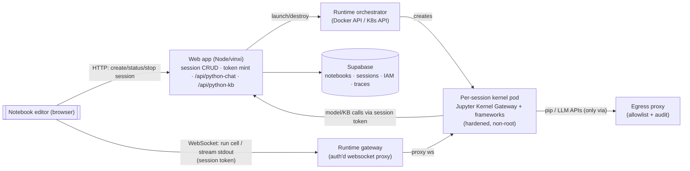
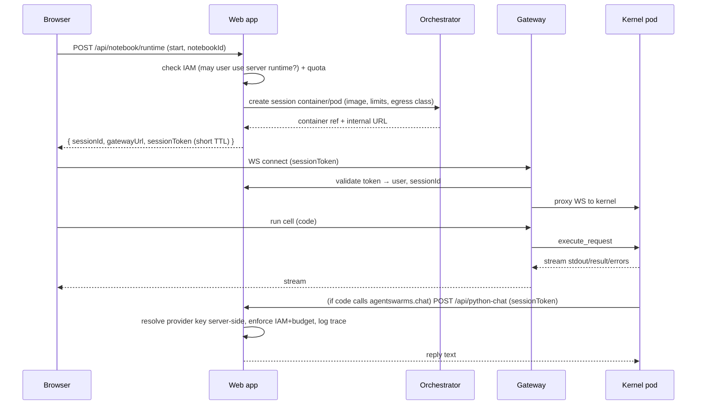

# Developer Workspace — Server-Side Python Runtime

> **Status: Phase 1 implemented (pending end-to-end validation on a Docker/K8s
> host); phases 2–4 pending.** This document is the implementation, security,
> and deployment plan for the real, server-side Python runtime that lets
> notebooks `pip install` and run actual frameworks (LangChain, LlamaIndex,
> LangGraph, …) alongside the in-browser Pyodide "Lite" mode.
>
> **What's built (Phase 1):** migration + settings/grants (`notebook_runtime_*`),
> session-token minting, the pluggable orchestrator (`docker`/`k8s`/`e2b` under
> `src/utils/notebookRuntime/`), the control-plane routes
> (`/api/notebook/runtime[/result|/source|/reap]`), session-token acceptance in
> `/api/python-chat|kb`, the kernel image (`docker/notebook-runtime/`), the
> websocket gateway (`services/notebook-gateway/`), the egress proxy + Docker
> Compose (`docker-compose.notebooks.yml`) and Kubernetes (`deploy/k8s/notebooks/`)
> topology, and the editor's Lite/Server switcher. The feature is **off by
> default** (`server_runtime_enabled=false` + no signing secret).
>
> **Not yet validated:** the container/websocket/K8s paths need a Docker or K8s
> host to exercise — run the §13 test suite there. **Phases 2–4** (hardening
> pass, K8s polish, E2B) remain per §11.

---

## 1. Goals & non-goals

**Goals**

- Run **real CPython** on the server with `pip install <anything>` and real network access, so the actual framework packages work.
- **Self-hosted, on-prem** — no external SaaS or per-sandbox billing required; code and data never leave the operator's infrastructure.
- Runs on **Windows and Linux hosts** (Docker Desktop/WSL2 on Windows; Docker or Kubernetes on Linux).
- **Secure by default** for the platform's real threat model (authenticated, IAM-governed enterprise users — see §2).
- **Scalable** from a single laptop to a Kubernetes cluster with the _same_ container image.
- Fully **governed**: model/KB calls from a server kernel still respect IAM model rules and budgets and land in Traces, exactly like `agentswarms.chat()` does today.
- **Pluggable** backend (`docker` | `k8s` | `e2b`) so operators can upgrade isolation without an app rewrite.

**Non-goals (initially)**

- GPU scheduling inside kernels (design leaves room; not in phase 1–3).
- Running genuinely _untrusted, anonymous, public_ code (that's the microVM/E2B tier; see §5.6).
- Replacing Pyodide. The browser "Lite" runtime stays for the zero-setup teaching samples.

---

## 2. Threat model

The people writing notebooks here are **authenticated enterprise users**, provisioned and governed by [IAM](./IAM.md) — not anonymous internet visitors. So the realistic risks, in priority order:

1. **Egress / SSRF & data exfiltration** — a notebook reaching the cloud metadata endpoint (`169.254.169.254`), internal services, the database, or exfiltrating secrets. **This is the #1 risk and the main thing hardening must stop.**
2. **Credential theft** — a notebook reading provider API keys or the Supabase service-role key out of its environment.
3. **Resource abuse** — fork bombs, memory hogs, infinite loops, disk fill (noisy-neighbour / DoS).
4. **Cross-tenant access** — user A reading user B's files, processes, or attaching to their kernel.
5. **Host/kernel escape** — breaking out of the container to the host. Lowest likelihood given #1–#4 are closed and users are semi-trusted; mitigated further by optional gVisor/microVM tiers (§5.6).

Hardened shared-kernel containers (§5) close #1–#4 well; #5 is defense-in-depth via RuntimeClass/microVM on Linux prod.

---

## 3. Architecture



**Cell-run sequence**



Key property: **provider API keys and the service-role key never enter the sandbox.** Model/KB calls are brokered by the web app using the same server-side credential resolution as `/api/python-chat` today; the kernel only holds a short-lived, session-scoped capability token.

---

## 4. Components

### 4.1 Per-session kernel image (`agentswarms/notebook-runtime`)

- Base: `python:3.12-slim` (or `jupyter/base-notebook`).
- Runs **[Jupyter Kernel Gateway](https://jupyter-kernel-gateway.readthedocs.io/) in websocket mode** — a battle-tested server that exposes one IPython kernel over HTTP/WebSocket. This is the "robust, headache-free" choice: we don't hand-roll a kernel protocol.
- Pre-installs the common heavy frameworks (`langchain`, `langchain-openai`, `langgraph`, `llama-index`, `pydantic`, `httpx`, `pandas`, `numpy`) so the frequent case needs no install and is deterministic. Additional `pip install`s work at runtime through the egress proxy.
- Ships the `agentswarms` Python helper (`chat`, `kb_search`, `list_knowledge_bases`, `format_context`, plus the framework adapters `chat_model`, `llama_llm`, `kb_retriever`) pointed at the **in-cluster app URL** and authenticating with the injected session token. `chat_model()` returns a real LangChain `BaseChatModel` and supports **tool-calling** via `bind_tools([...])`, so LangGraph's `create_react_agent` / `ToolNode` work — the model's `tool_calls` are brokered through `/api/python-chat` and stay governed. Because the helper is baked into the image (`COPY agentswarms_helper.py → agentswarms.py`), **rebuild `agentswarms/notebook-runtime:latest` whenever the helper changes** for running deployments to pick it up.
- Non-root user baked in; no build tools that require root at runtime.

**Three modes, selected by `NB_MODE`** (see `docker/notebook-runtime/entrypoint.sh`):

| `NB_MODE`               | Session `kind` | Process                             | Used by                                          |
| ----------------------- | -------------- | ----------------------------------- | ------------------------------------------------ |
| `interactive` (default) | `interactive`  | Jupyter Kernel Gateway, one kernel  | Notebook cells over the websocket gateway        |
| `batch`                 | `batch`        | `batch_runner.py`, runs and exits   | Scheduled jobs, notebooks published as an API    |
| `mcp`                   | `service`      | `mcp_runner.py`, serves `:8888/mcp` | **MCP Builder** — a user-authored FastMCP server |

The `service` kind is the only long-lived one. It differs from an interactive kernel in exactly two
places — the readiness probe (its own `/mcp` path rather than Jupyter's `/api`, and any status
below 500 counts, because a conformant MCP endpoint answers a bare GET with 405/406) and a bounded
`on-failure` restart policy when the app is marked _keep warm_. Every hardening flag in §5 is
identical; if a future change needs a third difference, that is a signal to re-examine it rather
than widen the sandbox.

`mcp_runner.py` also fetches its bundle — source, extra requirements and resolved secret
environment — from `/api/notebook/runtime/source` using the session token, rather than receiving
any of it as container environment. A response body is not visible to `docker inspect` or in a pod
spec, so bound secrets exist only in the sandbox process's memory (§5.5).

### 4.2 Orchestrator (pluggable)

Interface (`NotebookOrchestrator`): `create(session) → {ref, url}`, `stop(ref)`, `status(ref)`, `list()`.

- **`DockerOrchestrator`** (dev / single host): talks to the Docker Engine API. The web app does **not** get raw `docker.sock`; instead a minimal **socket-proxy** (e.g. `tecnativa/docker-socket-proxy`) exposes only `POST /containers/create|start|stop|remove` — least privilege.
- **`K8sOrchestrator`** (enterprise): creates a **Pod/Job per session** via the K8s API using a dedicated `ServiceAccount` with RBAC scoped to one namespace (`create/delete pods` only). This is cleaner and safer than the Docker socket.
- **`E2BOrchestrator`** (optional): for teams that want managed Firecracker microVMs; same interface, points at E2B.

### 4.3 Runtime gateway

A small stateless service (Node or Python) that: authenticates the **session token**, verifies the caller owns that session, and proxies the WebSocket to the correct kernel pod (cluster-internal DNS). Keeps live-kernel websockets out of the vinxi app and scales independently. On single-host Docker it's a tiny container; on K8s it's a Deployment behind the ingress.

### 4.4 Egress proxy

The kernel pods have **no direct internet route**. Their only egress is an **HTTP/HTTPS forward proxy** the platform runs, which enforces a domain **allowlist** (PyPI + configured LLM endpoints + the app's own API) and **audits** every outbound request. Portable across Docker and K8s. On K8s, additionally enforce a `NetworkPolicy` (default-deny egress, allow only the proxy + DNS) so the proxy can't be bypassed.

---

## 5. Isolation & hardening (concrete spec)

### 5.1 Container runtime flags (Docker profile)

```
--user 65534:65534            # non-root (or a baked 'runner' uid)
--read-only                   # read-only root filesystem
--tmpfs /home/runner/work:rw,size=512m,noexec? (exec needed for venvs → omit noexec on workdir)
--cap-drop=ALL                # no Linux capabilities
--security-opt=no-new-privileges
--security-opt seccomp=notebook-seccomp.json   # tuned profile (start from Docker default)
--pids-limit=256              # stop fork bombs
--memory=2g --memory-swap=2g  # hard memory ceiling, no swap
--cpus=1.0                    # CPU quota
--network=nb-egress           # isolated bridge; DNS→proxy only (no host, no other pods)
# NO host bind mounts, NO docker.sock, NO --privileged
```

### 5.2 Kubernetes profile (`securityContext` + policy)

- `runAsNonRoot: true`, `readOnlyRootFilesystem: true`, `allowPrivilegeEscalation: false`, `capabilities.drop: [ALL]`, `seccompProfile.type: RuntimeDefault`.
- `resources.limits` (cpu/memory/ephemeral-storage) + `activeDeadlineSeconds` on the Job (hard wall-clock cap).
- `NetworkPolicy`: default-deny ingress+egress; allow egress only to the egress-proxy Service and kube-dns; allow ingress only from the runtime gateway.
- Dedicated namespace `agentswarms-notebooks` with a `ResourceQuota` and `LimitRange`.
- Optional `RuntimeClass: gvisor` (runsc) for user-space-kernel isolation on Linux — **zero app changes**, just a scheduling attribute.

### 5.3 Time & lifecycle limits

- **Per-cell timeout** (e.g. 120 s default, configurable): the gateway interrupts the kernel; a second miss kills the pod.
- **Session idle TTL** (e.g. 30 min): reaper destroys idle sessions.
- **Session max lifetime** (e.g. 8 h): hard cap regardless of activity.
- **Concurrency caps**: max sessions per user and per instance (protects the cluster).

### 5.4 Filesystem

- Root FS read-only; the only writable path is the ephemeral work dir (lost on teardown — notebooks persist in Supabase, not on the kernel disk).
- No host mounts; no shared volumes between sessions.

### 5.5 Secrets & governance (critical)

- The sandbox environment contains **no** provider API keys and **no** Supabase service-role key. Verified by an automated test (§13).
- Model/KB access is brokered: the kernel calls `/api/python-chat` / `/api/python-kb` with a **session token** (a short-TTL JWT signed by the platform, scoped to `{userId, sessionId, scope: notebook-runtime}`, refreshed by the gateway). The app resolves the real provider credentials server-side, enforces IAM model rules + budgets, and writes an `execution_traces` row — identical governance to the current Pyodide path.
- If a user wants to call an LLM _directly_ from the sandbox with their _own_ key, that's an explicit opt-in (they paste it into a cell); document that such keys then live in their session only.

### 5.6 Isolation tiers (operator choice)

| Tier            | Mechanism                                    | Host requirement                     | When                                              |
| --------------- | -------------------------------------------- | ------------------------------------ | ------------------------------------------------- |
| **A (default)** | Hardened container (§5.1/5.2) + egress proxy | Docker or K8s; **Windows or Linux**  | Standard enterprise, IAM-governed users           |
| **B**           | Tier A **+ gVisor RuntimeClass**             | Linux only                           | Stronger defense-in-depth, still self-hosted/free |
| **C**           | Firecracker microVM / E2B backend            | KVM/bare-metal Linux, or E2B account | Untrusted code or strict multi-tenant SaaS        |

---

## 6. Data model & migrations

New migration `supabase/migrations/<ts>_notebook_runtime.sql`:

- `notebook_runtime_sessions`
  - `id uuid pk`, `user_id uuid → auth.users`, `notebook_id uuid → user_python_notebooks (nullable for scratch)`, `backend text`, `container_ref text`, `status text check in ('starting','ready','error','stopped')`, `image text`, `cpu_limit`, `mem_limit_mb`, `started_at`, `last_active_at`, `stopped_at`, `error text`.
  - RLS: owner-only (`auth.uid() = user_id`), like `user_python_notebooks`.
- `notebook_runtime_settings` (single-row, admin-managed, mirrors the `iam_settings` pattern)
  - `server_runtime_enabled bool default false` (opt-in — the feature is off until an operator turns it on), `backend text default 'docker'`, `default_image text`, `max_sessions_per_user int`, `idle_ttl_minutes int`, `cell_timeout_seconds int`, `egress_allowlist text[]`, `pip_allowed bool default true`, `pip_allowlist text[] null` (null = any).
  - RLS: SELECT authenticated; UPDATE superadmin only.
- Optionally extend IAM: a `notebook_runtime` capability grantable per user/group (reuse the model-rules/grants machinery) so admins can gate _who_ may start server kernels.
- Model calls continue to use `execution_traces` (no change).

Some operator defaults are also settable via env: `NOTEBOOK_RUNTIME_ENABLED`, `NOTEBOOK_RUNTIME_BACKEND` and `NOTEBOOK_RUNTIME_IMAGE`.

**Env takes precedence over the settings row, not the other way round** (`process.env.NOTEBOOK_RUNTIME_BACKEND || data?.backend || "docker"`). An operator who sets the env var and then edits the admin UI will see the edit ignored, so pick one place per value.

Everything else on `notebook_runtime_settings` — `egress_allowlist`, the session and resource limits — is **database-only** and has no env override; set those in **Admin → Notebook runtime**. In particular there is no `NOTEBOOK_EGRESS_ALLOWLIST` env var. (`NOTEBOOK_EGRESS_ALLOWLIST_PATH` is a different thing: the path the allowlist is written to _inside_ the egress sidecar.)

`cell_timeout_seconds` is the one exception, and it is easy to trip over: the app reads it from the settings row, but the **websocket gateway enforces it from its own `NOTEBOOK_CELL_TIMEOUT_SECONDS`** (`services/notebook-gateway`, default `120`). They are separate values — change one in the admin UI and the gateway keeps using its own until you set the env var too.

---

## 7. App integration

New TanStack Start server routes (mirroring the existing `/api/python-*` style, JWT-authenticated):

- `POST /api/notebook/runtime/start` — body `{ notebookId? }`. Checks `server_runtime_enabled`, the user's `notebook_runtime` IAM capability, and per-user session cap; asks the orchestrator to create a pod; inserts a `notebook_runtime_sessions` row; returns `{ sessionId, gatewayUrl, sessionToken }`.
- `GET /api/notebook/runtime/:id/status` — poll while `starting`.
- `POST /api/notebook/runtime/:id/stop` — teardown.
- `POST /api/notebook/runtime/:id/token` — refresh the short-TTL session token.
- Existing `/api/python-chat` and `/api/python-kb` gain a second accepted credential: the **session token** (in addition to the user JWT), resolving to the same `userId` so IAM/budget/trace logic is unchanged.

Reuse the existing pieces: `getEffectiveModelRules`/`isModelAllowed` (IAM gate), `resolveOpenAICompatTransport` (provider creds), `execution_traces` insert (tracing). The **runtime provider abstraction** lives in `src/utils/notebookRuntime/` (`orchestrator.ts` interface + `docker.ts`, `k8s.ts`, `e2b.ts`).

---

## 8. UI

- **Runtime switcher** in the notebook editor header: `Lite (browser)` ⟷ `Server (full Python)`. Server shows a session status pill (`starting → ready`), a **Restart kernel** and **Stop** button, and current limits (mem/CPU/timeout).
- When Server is selected, cell execution goes over the gateway websocket instead of `runPythonCell` (Pyodide). Same cell UI, same output rendering.
- **Packages**: `!pip install …` in a cell just works; optionally a small "Packages" panel that shows installed versions and lets users add from the allowlist.
- The four framework **samples** stay runnable in Lite (teaching), and each gains a note: _"Switch to Server runtime to run the real `langchain`/… package end-to-end."_ Optionally add real-framework sample variants that require Server.
- If `server_runtime_enabled` is false, the switcher shows a disabled "Server runtime — ask your admin to enable" state.

---

## 9. Deployment profiles

### 9.1 Single-host (dev & small teams) — Docker Compose

Adds four services to `docker-compose.yml`, all opt-in behind a compose profile `notebooks`:

```
notebook-gateway     # ws proxy
docker-socket-proxy  # least-privilege container control for the orchestrator
notebook-egress      # filtering forward proxy (allowlist)
# kernel containers are created on demand by the orchestrator (not long-running)
```

Works on **Windows (Docker Desktop/WSL2)** and **Linux**. The `agentswarms/notebook-runtime` image is built from `docker/notebook-runtime/Dockerfile`.

### 9.2 Enterprise — Kubernetes

- Helm chart / manifests under `deploy/k8s/notebooks/`: gateway Deployment + Service + Ingress, egress-proxy Deployment, the `agentswarms-notebooks` namespace with `ResourceQuota`/`LimitRange`/`NetworkPolicy`, and the RBAC `ServiceAccount` for the orchestrator.
- Kernels run as **Jobs** (per session) with the securityContext of §5.2; optional `RuntimeClass: gvisor`.
- Horizontal scale is automatic (each session is its own Job); cap total load with the namespace `ResourceQuota`.

### 9.3 Windows note

Kernel containers are **Linux containers** (the frameworks are Linux-first). On Windows they run under Docker Desktop's WSL2 Linux VM — fully supported. gVisor/Firecracker tiers are Linux-prod only (documented as such).

---

## 10. Scaling & lifecycle

- **Cold start**: container ~1–3 s with a warmed base image; keep a small **warm pool** of idle kernels (optional) for instant attach.
- **Reaper**: a cron (reuse the existing scheduled-job mechanism) sweeps `notebook_runtime_sessions` for idle/expired sessions and calls `orchestrator.stop`.
- **Backpressure**: per-user and per-instance session caps; when at capacity, `start` returns a clear "runtime at capacity" error.
- **Crash recovery**: orphaned containers (app restarted) are reconciled by matching `container_ref` labels on startup and reaping unknowns.

---

## 11. Rollout phases (each independently shippable)

1. **MVP (single-host Docker)** — runtime image (JKG + frameworks), `DockerOrchestrator` via socket-proxy, gateway, session model + `/api/notebook/runtime/*`, UI switcher, session-token brokering into `/api/python-*`. Egress proxy + Tier-A hardening. _Outcome: `import langchain` works end-to-end on one host._
2. **Security hardening pass** — seccomp profile, egress allowlist enforcement + audit, resource/timeout/idle limits, reaper, token scoping, IAM `notebook_runtime` capability, audit events. _Outcome: passes the §13 security suite._
3. **Kubernetes backend** — `K8sOrchestrator`, manifests/Helm, `NetworkPolicy`, quotas, optional gVisor RuntimeClass, autoscale. _Outcome: enterprise-scale deploy._
4. **Polish & optional** — warm pool, packages panel, real-framework sample variants, `E2BOrchestrator`, GPU-node opt-in.

---

## 12. Documentation deliverables

- `docs/INSTALL.md`: new "Enabling the server runtime" section (Docker profile + Windows/Linux notes, the container-runtime dependency, how to turn it on).
- `docs/DEPLOYMENT.md`: the K8s profile, hardening knobs, egress allowlist, scaling.
- `docs/SECURITY.md` (or a section): the threat model + isolation tiers, so operators can make an informed risk decision.
- In-app `/docs/notebooks`: Lite vs Server runtime, when to use each.

---

## 13. How to test

Testing has five layers. **The security suite (13.3) is the gate** — the feature must not ship a phase past #2 until every check passes.

### 13.1 Unit tests (CI, no Docker needed)

- `orchestrator` interface with a **mock backend**: `create/stop/status/list` state transitions; reconciliation of orphaned refs.
- **Session-token** minting/verification: correct `{userId, sessionId, scope}`, TTL expiry rejected, wrong-scope rejected, another user's token can't drive your session.
- **Egress allowlist** parser + matcher (domain globs, default-deny).
- `/api/python-chat` accepting a session token resolves to the right `userId` and still applies IAM/budget (extend existing tests).

### 13.2 Integration tests (CI job with Docker-in-Docker, gated on `docker` availability)

- **Lifecycle**: start session → status becomes `ready` → run a cell → get output → idle-reap → `stopped`.
- **State sharing**: define `x=41` in cell 1, `x+1` in cell 2 → `42` (kernel persistence).
- **Framework smoke** (the whole point):
  ```python
  import langchain, langgraph
  from llama_index.core import Document
  print(langchain.__version__, "ok")
  ```
  must succeed in the Server runtime.
- **Runtime pip install**:
  ```python
  !pip install cowsay -q
  import cowsay; cowsay.cow("hi")
  ```
- **Governed model call**:
  ```python
  print(await agentswarms.chat("say hi", provider="openrouter", model="openai/gpt-4o-mini"))
  ```
  → returns text **and** a new `execution_traces` row exists for the user.
- **Cell timeout**: `while True: pass` is interrupted at the configured limit and surfaces a clear error.
- **Kernel restart** clears state (`x` is now undefined).

### 13.3 Security suite (the gate) — run these as cells; each must behave as marked

| #   | Test cell                                                                                                       | Expected                                                      |
| --- | --------------------------------------------------------------------------------------------------------------- | ------------------------------------------------------------- |
| S1  | `import urllib.request as u; u.urlopen("http://169.254.169.254/latest/meta-data/", timeout=3)`                  | **FAIL** (blocked egress)                                     |
| S2  | `u.urlopen("http://<internal-app-or-db-host>:5432", timeout=3)`                                                 | **FAIL** (NetworkPolicy/proxy)                                |
| S3  | `u.urlopen("https://pypi.org/simple/", timeout=5)`                                                              | **PASS** (allowlisted)                                        |
| S4  | `open("/etc/passwd","a")` / `open("/usr/bin/x","w")`                                                            | **FAIL** (read-only rootfs)                                   |
| S5  | `open("/home/runner/work/t.txt","w").write("ok")`                                                               | **PASS** (only writable path)                                 |
| S6  | `import os; os.getuid()`                                                                                        | **non-zero** (non-root)                                       |
| S7  | `import subprocess; subprocess.run(["apt-get","install","-y","curl"])`                                          | **FAIL** (no root/caps)                                       |
| S8  | `[os.environ.get(k) for k in ("OPENAI_API_KEY","SUPABASE_SERVICE_ROLE_KEY","OPENROUTER_API_KEY")]`              | all **None** (no secrets in sandbox)                          |
| S9  | `import os; os.listdir("/var/run/docker.sock")` / stat it                                                       | **FAIL** (no docker socket)                                   |
| S10 | fork bomb `import os\nwhile True: os.fork()`                                                                    | killed by `pids-limit`; session survives or is reaped cleanly |
| S11 | memory hog `x=bytearray(4*1024**3)`                                                                             | OOM-killed at the mem limit, not the host                     |
| S12 | Cross-tenant: user B calls `GET/stop` on user A's `sessionId`; user B connects the gateway with A's `sessionId` | **403 / rejected**                                            |
| S13 | Escape probe: `os.listdir("/proc/1/root")`, mount attempts                                                      | **FAIL** (no caps, no host view)                              |

Automate S1–S13 as a pytest that drives a real session through the gateway and asserts pass/fail. Wire into CI (Linux) and document the manual run for Windows.

### 13.4 Load / scale

- Spawn N concurrent sessions (e.g. 25, 100); measure spawn latency, per-kernel memory, and that the per-instance cap rejects overflow gracefully.
- Idle-reaper correctness under load (no leaked containers — assert `docker ps` / `kubectl get pods` returns to baseline).
- K8s: confirm the namespace `ResourceQuota` caps total consumption and HPA/Job scheduling behaves.

### 13.5 Manual E2E matrix (must pass on both OSes)

| Host                                   | Backend | Checks                                                                                                                     |
| -------------------------------------- | ------- | -------------------------------------------------------------------------------------------------------------------------- |
| **Windows 11 + Docker Desktop (WSL2)** | docker  | start Server session, `import langchain`, run a LangGraph sample end-to-end, governed `chat()`, stop; run the S1–S13 suite |
| **Linux + Docker**                     | docker  | same                                                                                                                       |
| **Linux + Kubernetes**                 | k8s     | same + NetworkPolicy blocks S1/S2, quota caps load, optional gVisor RuntimeClass active                                    |

### 13.6 Acceptance criteria (definition of done)

- [ ] `import langchain / langgraph / llama_index` and a real end-to-end agent run succeed in Server runtime on Windows **and** Linux.
- [ ] Every S1–S13 security check passes (automated).
- [ ] Model/KB calls from Server runtime enforce IAM rules, count toward budgets, and appear in Traces (parity with Pyodide).
- [ ] Idle/expired/over-cap sessions are reaped with zero leaked containers.
- [ ] Feature is **off by default** (`server_runtime_enabled=false`) and gated by an IAM capability when on.
- [ ] Docs (INSTALL/DEPLOYMENT/SECURITY/in-app) updated; `docker-compose --profile notebooks up` brings the stack up cleanly.

---

## 14. Risks & open questions

- **Websockets through the stack.** Confirmed approach keeps live kernel websockets in the dedicated gateway (not vinxi). Validate the gateway ↔ JKG protocol early in phase 1.
- **Operational weight for tiny deploys.** Mitigation: everything is behind the `notebooks` compose profile and `server_runtime_enabled=false` — a hobby operator is unaffected until they opt in.
- **pip supply-chain.** `pip_allowlist` (optional) and the audited egress proxy constrain what can be pulled; document the residual risk.
- **Base-image size** (frameworks are heavy). Mitigation: multi-stage build, prune, and pin versions; publish the image so operators don't build it.
- **gVisor syscall gaps.** Some native libs misbehave under runsc; keep Tier A the default and Tier B opt-in.

## 15. Rough effort

Phase 1 (MVP) ≈ the bulk; phases 2–3 are hardening + K8s. Estimate ~1.5–3 weeks of focused work to a production-ready phase 3, plus image maintenance. Phase 1 alone yields a demoable "real LangChain in a notebook" on a single host.
