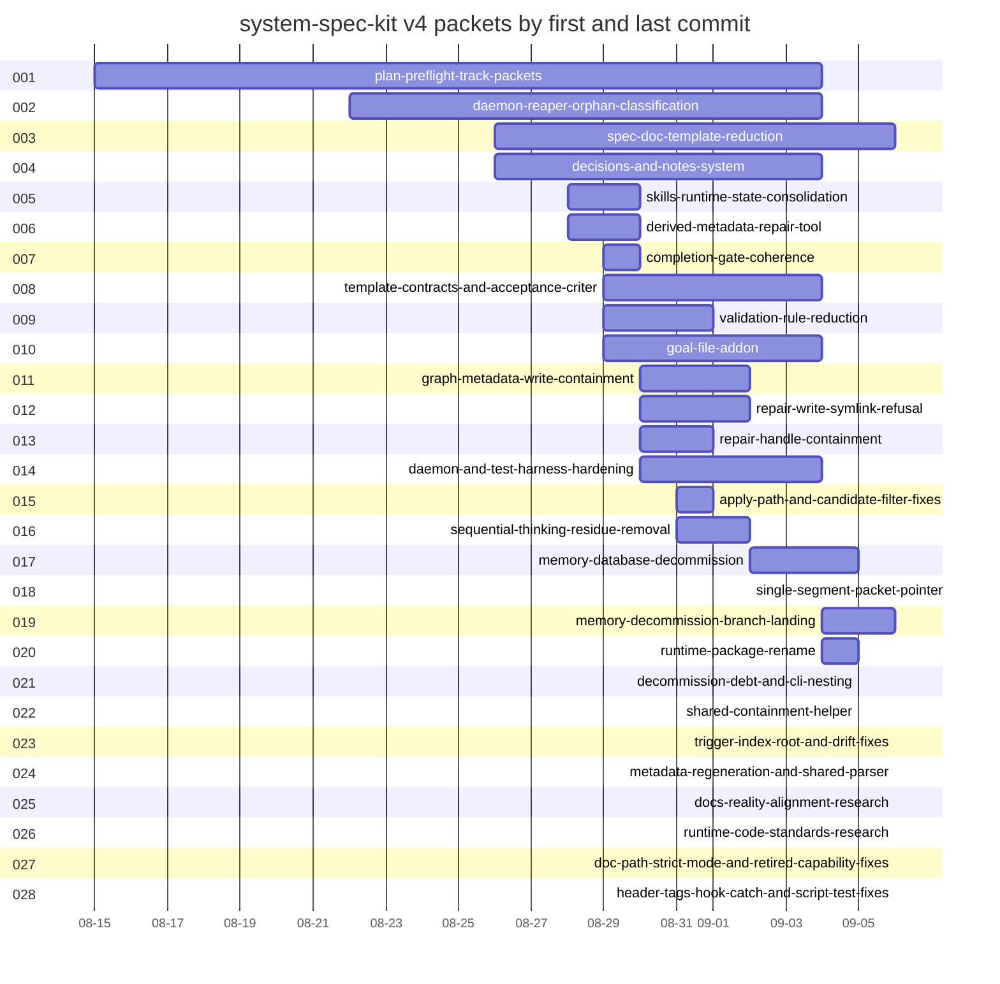

# Timeline: system-speckit-v4

<!-- SPECKIT_TEMPLATE_SOURCE: timeline | v2.2 -->
<!-- HVR_REFERENCE: .opencode/skills/sk-doc/sk-create-with-human-voice/references/hvr-rules.md -->

> The order in which the twenty-four v4 packets were started and finished, taken from git.

---

<!-- ANCHOR:metadata -->
## 1. METADATA

**Subject:** system-spec-kit v4, children 001 to 028 of this parent
**Status:** Complete
**Started:** 2026-08-15
**Last updated:** 2026-09-06
**Owner:** the spec-kit maintainers; regenerated from `git log`, nothing hand-typed
<!-- /ANCHOR:metadata -->

---

<!-- ANCHOR:timeline -->
## 2. TIMELINE

Each entry is a packet's first commit. The outcome names what the packet left behind and when its last commit landed.

**2026-08-15:** `001-plan-preflight-track-packets` (was `034-plan-preflight-nested-packet-resolution`) started; 8 commits over 0 nested phases. Outcome: The /speckit:plan Step-5 prerequisite helper resolves the feature dir from the git branch and hard-rejects any non-NNN branch, so it cannot target a track-nested packet such as specs/anobel.com/008-di. Status Complete; last commit 2026-09-04.

**2026-08-22:** `002-daemon-reaper-orphan-classification` (was `035-process-reaper-classification-fix`) started; 9 commits over 0 nested phases. Outcome: The daemon-reaper misclassifies an orphaned spec-memory server as an external MCP process because its external-MCP guard matches the mcp-server/ directory in the daemon's own path. Status Complete; last commit 2026-09-04.

**2026-08-26:** `003-spec-doc-template-reduction` (was `036-spec-doc-template-reduction`) started; 28 commits over 13 nested phases. Outcome: Phase parent for Reduce and optimize spec-kit doc templates; merge tasks and checklist; less bloat, better historic context and small-model legibility. Status Draft; last commit 2026-09-06.

**2026-08-26:** `004-decisions-and-notes-system` (was `037-decisions-memory-redesign`) started; 15 commits over 6 nested phases. Outcome: Phase parent for Deprecate constitutional memory; build a separate actively-used decisions and notes system integrated with spec and skill. Status Draft; last commit 2026-09-04.

**2026-08-28:** `005-skills-runtime-state-consolidation` (was `038-skills-state-consolidation`) started; 6 commits over 0 nested phases. Outcome: Seven runtime-state directories sit directly under .opencode/skills/, so the folder a user opens to find skills shows mostly machine state instead. Status Complete; last commit 2026-08-30.

**2026-08-28:** `006-derived-metadata-repair-tool` (was `039-derived-repair-automation`) started; 10 commits over 0 nested phases. Outcome: Repair the spec-packet validation failures that are recomputable from repository state, and refuse the ones that record work a person did. Status In Progress; last commit 2026-08-30.

**2026-08-29:** `007-completion-gate-coherence` (was `040-validation-gate-coherence`) started; 10 commits over 0 nested phases. Outcome: Make the completion gate return the same verdict whatever the environment, stop counting one fault several times, and remove the checks a packet cannot satisfy from inside itself. Status Complete; last commit 2026-08-30.

**2026-08-29:** `008-template-contracts-and-acceptance-criteria` (was `033-spec-kit-template-optimization`) started; 24 commits over 4 nested phases. Outcome: Phase parent for spec-kit document-template optimization: level-gated template contracts, context-cost reduction, and a canonical acceptance-criteria document that gates packet closure at Levels 2, 3 . Status In Progress; last commit 2026-09-04.

**2026-08-29:** `009-validation-rule-reduction` (was `041-validation-reduction`) started; 19 commits over 8 nested phases. Outcome: Reduce the completion gate to the few checks a machine actually reads, and make the rest impossible to violate rather than detected afterwards. Status Complete; last commit 2026-09-01.

**2026-08-29:** `010-goal-file-addon` (was `042-nested-goal-template-addon`) started; 15 commits over 4 nested phases. Outcome: Phase parent for a goal.md addon: a short durable parent directive that references per-phase child goal files, entering the Level contract as a lazy add-on and reaching the speckit command surface run. Status In Progress; last commit 2026-09-04.

**2026-08-30:** `011-graph-metadata-write-containment` (was `043-workspace-path-containment`) started; 7 commits over 0 nested phases. Outcome: The graph-metadata write guard classified a destination as spec-shaped and wrote it, so any path containing a specs segment was accepted - including one outside the repository. Status Complete; last commit 2026-09-02.

**2026-08-30:** `012-repair-write-symlink-refusal` (was `044-repair-write-symlink-refusal`) started; 8 commits over 0 nested phases. Outcome: The repair script decided a path was a regular file during its scan and wrote it later. Status Complete; last commit 2026-09-02.

**2026-08-30:** `013-repair-handle-containment` (was `046-path-containment-followups`) started; 7 commits over 0 nested phases. Outcome: The repair write decides a path is safe by inspecting it, then writes through a handle that can point somewhere else: swapping a scanned directory for a symlink overwrites a file outside the tree. Status Complete; last commit 2026-09-01.

**2026-08-30:** `014-daemon-and-test-harness-hardening` (was `045-daemon-and-test-harness-hardening`) started; 12 commits over 4 nested phases. Outcome: Phase parent for four production-observed failure classes in daemon supervision and the vitest harness, each traced to a safety mechanism that exists and is correct but is never reached at runtime. Status Complete; last commit 2026-09-04.

**2026-08-31:** `015-apply-path-and-candidate-filter-fixes` (was `047-review-remediation`) started; 8 commits over 0 nested phases. Outcome: Three P1 findings survived four deep-review iterations across three models: an apply path that treated an omitted enable decision as permission, a candidate filter that judged from a stale snapshot, a. Status Complete; last commit 2026-09-01.

**2026-08-31:** `016-sequential-thinking-residue-removal` (was `048-decommissioned-server-residue`) started; 5 commits over 0 nested phases. Outcome: The doctor command family still probes, reports on, and offers to reinstall the Sequential Thinking MCP server that was decommissioned in commit 7673da6bc24, and specs/sk-doc carries an empty false-st. Status Complete; last commit 2026-09-02.

**2026-09-02:** `017-memory-database-decommission` (was `049-memory-decommission`) started; 22 commits over 7 nested phases. Outcome: Phase parent for removing the system-spec-memory MCP database subsystem and replacing it with grep-first retrieval. Status Complete; last commit 2026-09-05.

**2026-09-02:** `018-single-segment-packet-pointer` (was `050-single-segment-packet-pointer`) started; 4 commits over 0 nested phases. Outcome: Let SPECDOC_FRONTMATTER_004 accept a single safe path segment in packet_pointer instead of demanding a track/name pair, so a repository that keeps packets directly under specs/ can pass. Status Draft; last commit 2026-09-02.

**2026-09-04:** `019-memory-decommission-branch-landing` (was `052-memory-decommission-landing`) started; 49 commits over 0 nested phases. Outcome: The memory-database decommission existed only on a side branch while the release branch and main still carried the memory server, its hooks and its commands; this packet lands the branch, aligns the c. Status Complete; last commit 2026-09-06.

**2026-09-04:** `020-runtime-package-rename` (was `053-spec-kit-runtime-rename`) started; 12 commits over 0 nested phases. Outcome: The surviving spec-kit package still carries an MCP identity it no longer has: folder and npm name say mcp-server, the MCP SDK and six other dependencies have no importer, and about 140 live files poi. Status Complete; last commit 2026-09-05.

**2026-09-05:** `021-decommission-debt-and-cli-nesting` (was `054-decommission-debt-fixes`) started; 43 commits over 7 nested phases. Outcome: Close the debt the memory-decommission review loop recorded, move the trigger index under runtime, and align the runtime and scripts packages with the OpenCode code standards and code-folder README co. Status Complete; last commit 2026-09-05.

**2026-09-05:** `022-shared-containment-helper` (was `055-path-containment-seam`) started; 4 commits over 0 nested phases. Outcome: The CLI checked write boundaries three different ways: lexically in the changelog generator, realpath-only in the description generator, and canonically in the shared utilities. Status Complete; last commit 2026-09-05.

**2026-09-06:** `023-trigger-index-root-and-drift-fixes` (was `056-integration-research-remediation`) started; 7 commits over 4 nested phases. Outcome: Phase parent for remediating the eleven findings of the Sonnet 5 integration research: the trigger-index root regression and README rule count, phantom children and unvalidated track roots, the deferr. Status Complete; last commit 2026-09-06.

**2026-09-06:** `024-metadata-regeneration-and-shared-parser` (was `057-metadata-regeneration-and-parser-edges`) started; 5 commits over 0 nested phases. Outcome: Run the identity-aware metadata writer over every drifted packet that is clean in git, give system-deep-loop and sk-doc a dependency edge to the spec-kit shared package, and adopt the shared frontmatt. Status Complete; last commit 2026-09-06.

**2026-09-06:** `025-docs-reality-alignment-research` started; 1 commit over 0 nested phases. Outcome: A ten-iteration DeepSeek V4 Flash lane on the pi CLI checked the playbook, catalog and references against the runtime; seventeen mismatches reported, fourteen reproduced; a two-iteration Gemini 3.8 Flash pass added nineteen more, eighteen reproduced. Status Complete; last commit 2026-09-06.

**2026-09-06:** `026-runtime-code-standards-research` started; 1 commit over 0 nested phases. Outcome: A parallel ten-iteration lane audited the shared package and runtime against the sk-code standards; eighteen deviations reported, twelve confirmed, four dropped with evidence; a two-iteration Gemini 3.8 Flash pass added sixteen more, all reproduced, including the misplaced telemetry store. Status Complete; last commit 2026-09-06.

**2026-09-06:** `027-doc-path-strict-mode-and-retired-capability-fixes` started; 1 commit over 0 nested phases. Outcome: The fourteen confirmed doc mismatches plus eighteen from the Gemini pass fixed at their cited lines, plus same-class sites; strict mode, moved paths, phantom rules and retired capabilities now match the runtime. Status Complete; last commit 2026-09-06.

**2026-09-06:** `028-header-tags-hook-catch-and-script-test-fixes` started; 1 commit over 0 nested phases. Outcome: Header tags normalized, silent hook catches made to report, dead modules and migrations removed, scripts and the API given tests, the completeness errexit bug fixed, and the shared config root bug that lost phase parents' active-child pointers fixed with the classifier taught to read the store. Status Complete; last commit 2026-09-06.

### Chronology table

| # | Slot | Old id | First | Last | Commits | Nested | Status |
|---|------|--------|-------|------|---------|--------|--------|
| 1 | `001-plan-preflight-track-packets` | `034-plan-preflight-nested-packet-resolution` | 2026-08-15 | 2026-09-04 | 8 | 0 | Complete |
| 2 | `002-daemon-reaper-orphan-classification` | `035-process-reaper-classification-fix` | 2026-08-22 | 2026-09-04 | 9 | 0 | Complete |
| 3 | `003-spec-doc-template-reduction` | `036-spec-doc-template-reduction` | 2026-08-26 | 2026-09-06 | 28 | 13 | Draft |
| 4 | `004-decisions-and-notes-system` | `037-decisions-memory-redesign` | 2026-08-26 | 2026-09-04 | 15 | 6 | Draft |
| 5 | `005-skills-runtime-state-consolidation` | `038-skills-state-consolidation` | 2026-08-28 | 2026-08-30 | 6 | 0 | Complete |
| 6 | `006-derived-metadata-repair-tool` | `039-derived-repair-automation` | 2026-08-28 | 2026-08-30 | 10 | 0 | In Progress |
| 7 | `007-completion-gate-coherence` | `040-validation-gate-coherence` | 2026-08-29 | 2026-08-30 | 10 | 0 | Complete |
| 8 | `008-template-contracts-and-acceptance-criteria` | `033-spec-kit-template-optimization` | 2026-08-29 | 2026-09-04 | 24 | 4 | In Progress |
| 9 | `009-validation-rule-reduction` | `041-validation-reduction` | 2026-08-29 | 2026-09-01 | 19 | 8 | Complete |
| 10 | `010-goal-file-addon` | `042-nested-goal-template-addon` | 2026-08-29 | 2026-09-04 | 15 | 4 | In Progress |
| 11 | `011-graph-metadata-write-containment` | `043-workspace-path-containment` | 2026-08-30 | 2026-09-02 | 7 | 0 | Complete |
| 12 | `012-repair-write-symlink-refusal` | `044-repair-write-symlink-refusal` | 2026-08-30 | 2026-09-02 | 8 | 0 | Complete |
| 13 | `013-repair-handle-containment` | `046-path-containment-followups` | 2026-08-30 | 2026-09-01 | 7 | 0 | Complete |
| 14 | `014-daemon-and-test-harness-hardening` | `045-daemon-and-test-harness-hardening` | 2026-08-30 | 2026-09-04 | 12 | 4 | Complete |
| 15 | `015-apply-path-and-candidate-filter-fixes` | `047-review-remediation` | 2026-08-31 | 2026-09-01 | 8 | 0 | Complete |
| 16 | `016-sequential-thinking-residue-removal` | `048-decommissioned-server-residue` | 2026-08-31 | 2026-09-02 | 5 | 0 | Complete |
| 17 | `017-memory-database-decommission` | `049-memory-decommission` | 2026-09-02 | 2026-09-05 | 22 | 7 | Complete |
| 18 | `018-single-segment-packet-pointer` | `050-single-segment-packet-pointer` | 2026-09-02 | 2026-09-02 | 4 | 0 | Draft |
| 19 | `019-memory-decommission-branch-landing` | `052-memory-decommission-landing` | 2026-09-04 | 2026-09-06 | 49 | 0 | Complete |
| 20 | `020-runtime-package-rename` | `053-spec-kit-runtime-rename` | 2026-09-04 | 2026-09-05 | 12 | 0 | Complete |
| 21 | `021-decommission-debt-and-cli-nesting` | `054-decommission-debt-fixes` | 2026-09-05 | 2026-09-05 | 43 | 7 | Complete |
| 22 | `022-shared-containment-helper` | `055-path-containment-seam` | 2026-09-05 | 2026-09-05 | 4 | 0 | Complete |
| 23 | `023-trigger-index-root-and-drift-fixes` | `056-integration-research-remediation` | 2026-09-06 | 2026-09-06 | 7 | 4 | Complete |
| 24 | `024-metadata-regeneration-and-shared-parser` | `057-metadata-regeneration-and-parser-edges` | 2026-09-06 | 2026-09-06 | 5 | 0 | Complete |
| 25 | `025-docs-reality-alignment-research` | none | 2026-09-06 | 2026-09-06 | 1 | 0 | Complete |
| 26 | `026-runtime-code-standards-research` | none | 2026-09-06 | 2026-09-06 | 1 | 0 | Complete |
| 27 | `027-doc-path-strict-mode-and-retired-capability-fixes` | none | 2026-09-06 | 2026-09-06 | 1 | 0 | Complete |
| 28 | `028-header-tags-hook-catch-and-script-test-fixes` | none | 2026-09-06 | 2026-09-06 | 1 | 0 | Complete |

### Gantt

### Key commits

Up to five per packet, the earliest and the latest, excluding the consolidation moves.

**1. 001-plan-preflight-track-packets**

- `08a79be94d` 2026-08-15 fix(speckit-preflight): honor explicit SPECIFY_FEATURE for nested packets
- `a5c314fe8a` 2026-08-29 fix(graph): trust declared key files, and repair the packets the layout bug degraded
- `0ee9a2ab5e` 2026-08-30 fix(system-speckit): make the drift gate compare every packet that carries a digest
- `6fb5a7181e` 2026-09-04 docs(specs): retrofit the grep convention across the active spec corpus

**2. 002-daemon-reaper-orphan-classification**

- `d2d627a447` 2026-08-22 fix(spec-kit): correct reaper external-MCP classification for daemons under mcp-server/
- `aeb94c58e1` 2026-08-29 fix(specs): give every checklist the title its template asks for
- `27100df785` 2026-08-29 fix(graph): resolve repo-relative key files again, and restore what was dropped
- `6fb5a7181e` 2026-09-04 docs(specs): retrofit the grep convention across the active spec corpus
- `0ee9a2ab5e` 2026-08-30 fix(system-speckit): make the drift gate compare every packet that carries a digest

**3. 003-spec-doc-template-reduction**

- `40d9002f09` 2026-08-26 docs(system-speckit): add packets 036 template-reduction + 037 memory-redesign
- `5f45bcb009` 2026-08-26 docs(system-speckit): record the tasks+checklist merge blocker in 036/002
- `a83eddf607` 2026-08-27 chore(specs): refresh generated packet metadata
- `2f21545e3e` 2026-09-06 refactor(skills): finish adopting the shared frontmatter parser across deep-loop and spec-kit
- `144897ba5d` 2026-09-04 chore(merge): bring skilled/v4.0.0.0 into the decommission branch

**4. 004-decisions-and-notes-system**

- `40d9002f09` 2026-08-26 docs(system-speckit): add packets 036 template-reduction + 037 memory-redesign
- `a138859862` 2026-08-26 docs(system-speckit): re-scope 037 to deprecate constitutional layer without a replacement surface
- `ad6d27c1c3` 2026-08-26 docs(system-speckit): const-memory deprecation-completeness audit (037/004)
- `6fb5a7181e` 2026-09-04 docs(specs): retrofit the grep convention across the active spec corpus
- `0ee9a2ab5e` 2026-08-30 fix(system-speckit): make the drift gate compare every packet that carries a digest

**5. 005-skills-runtime-state-consolidation**

- `714611df81` 2026-08-28 refactor(skills): consolidate the seven runtime-state directories under .state
- `b492b08549` 2026-08-29 fix(graph): finish the key-file repair against the derivation itself
- `0ee9a2ab5e` 2026-08-30 fix(system-speckit): make the drift gate compare every packet that carries a digest

**6. 006-derived-metadata-repair-tool**

- `98db362206` 2026-08-28 feat(spec-kit): repair the packet failures that are recomputable
- `85a974bf4c` 2026-08-28 feat(spec-kit): harden, test, document and wire the derived-packet repair
- `867b983a79` 2026-08-29 docs(spec): reconcile the repair packet against what was actually verified
- `0ee9a2ab5e` 2026-08-30 fix(system-speckit): make the drift gate compare every packet that carries a digest
- `4570677ec7` 2026-08-30 refactor(system-speckit): retire the standalone verification checklist

**7. 007-completion-gate-coherence**

- `d643545742` 2026-08-29 docs(spec): untick what was never tested, and record the gate's verdict flip
- `f1142998b8` 2026-08-29 docs(spec): record what the measurements forced the plan to change
- `d02ca59a85` 2026-08-29 fix(spec-validation): close the review's remaining findings
- `0ee9a2ab5e` 2026-08-30 fix(system-speckit): make the drift gate compare every packet that carries a digest
- `4570677ec7` 2026-08-30 refactor(system-speckit): retire the standalone verification checklist

**8. 008-template-contracts-and-acceptance-criteria**

- `154d3564f6` 2026-08-29 docs(playbooks): bring the manual-testing corpus to the operator-scenario contract
- `e5a96897bf` 2026-08-29 docs(specs): include the straggler written during the previous commit
- `27100df785` 2026-08-29 fix(graph): resolve repo-relative key files again, and restore what was dropped
- `144897ba5d` 2026-09-04 chore(merge): bring skilled/v4.0.0.0 into the decommission branch
- `6fb5a7181e` 2026-09-04 docs(specs): retrofit the grep convention across the active spec corpus

**9. 009-validation-rule-reduction**

- `203e619815` 2026-08-29 feat(spec-validation): a warning stops being a failure
- `5bd9178c70` 2026-08-29 feat(spec-validation): a track directory is not a packet
- `1e144e9cdd` 2026-08-29 feat(spec-validation): the scaffold passes the gate it ships with
- `822ac55300` 2026-09-01 fix(routing): break the rebuild deadlock, and move the voice standard to its owner
- `0ee9a2ab5e` 2026-08-30 fix(system-speckit): make the drift gate compare every packet that carries a digest

**10. 010-goal-file-addon**

- `fada2779d2` 2026-08-29 docs(specs): open the nested-goal packet with its verified research
- `3fbc4265b0` 2026-08-29 docs(specs): plan the nested-goal addon as four verified phases
- `8d0b4443e9` 2026-08-29 feat(system-spec-kit): add a goal document to the documentation-level contract
- `144897ba5d` 2026-09-04 chore(merge): bring skilled/v4.0.0.0 into the decommission branch
- `6fb5a7181e` 2026-09-04 docs(specs): retrofit the grep convention across the active spec corpus

**11. 011-graph-metadata-write-containment**

- `6d21ed9c96` 2026-08-30 fix(system-speckit): prove workspace membership in the graph-metadata write guard
- `368531405d` 2026-08-30 fix(system-speckit): measure write containment against the destination's workspace
- `ec0f8a7deb` 2026-08-30 docs(system-speckit): record what two closed packets actually proved
- `d229b0a24d` 2026-09-02 fix(sk-doc): make the validators look where they were not looking

**12. 012-repair-write-symlink-refusal**

- `b6e8ff121b` 2026-08-30 fix(system-speckit): refuse symlink traversal in the graph-metadata repair write
- `f9cdb8b0c1` 2026-08-30 fix(system-speckit): actually land the symlink refusal, and test the shipped code
- `ec0f8a7deb` 2026-08-30 docs(system-speckit): record what two closed packets actually proved
- `7626af0db1` 2026-08-30 chore(system-speckit): restore two authored descriptions and checkpoint runtime state
- `d229b0a24d` 2026-09-02 fix(sk-doc): make the validators look where they were not looking

**13. 013-repair-handle-containment**

- `29fbbebdbd` 2026-08-30 docs(system-speckit): open a packet for the two path-containment gaps left open
- `23283338e6` 2026-08-30 refactor(system-speckit): remove the containment branch that decided nothing
- `7289a5173f` 2026-08-30 fix(system-speckit): prove the repair write reaches the file the scan classified
- `822ac55300` 2026-09-01 fix(routing): break the rebuild deadlock, and move the voice standard to its owner

**14. 014-daemon-and-test-harness-hardening**

- `c10772713e` 2026-08-30 docs(specs): add the daemon and test-harness hardening packet
- `2dcc38963a` 2026-08-30 fix(system-spec-kit): make production-database isolation unbypassable in tests
- `7d10eddf5f` 2026-08-30 feat(system-spec-kit): reap orphaned launchers instead of leaking them
- `6fb5a7181e` 2026-09-04 docs(specs): retrofit the grep convention across the active spec corpus
- `822ac55300` 2026-09-01 fix(routing): break the rebuild deadlock, and move the voice standard to its owner

**15. 015-apply-path-and-candidate-filter-fixes**

- `2571e9f0e4` 2026-08-31 fix(system-spec-kit): require an explicit decision to reap, and judge from fresh evidence
- `dbe8584c33` 2026-08-31 fix(system-spec-kit): stop test isolation depending on environment inheritance alone
- `0a28bb353c` 2026-08-31 fix(system-spec-kit): make orphan termination opt-in instead of on by default
- `bcd97f2c41` 2026-08-31 docs(specs): resolve the sweep dry-run question with a stubbed live probe
- `822ac55300` 2026-09-01 fix(routing): break the rebuild deadlock, and move the voice standard to its owner

**16. 016-sequential-thinking-residue-removal**

- `98f966c3c8` 2026-08-31 fix(doctor): stop reinstalling a server that was decommissioned in August
- `d229b0a24d` 2026-09-02 fix(sk-doc): make the validators look where they were not looking

**17. 017-memory-database-decommission**

- `e4a80ed973` 2026-09-02 docs(specs): plan memory DB decommission as phased packet 049
- `d229b0a24d` 2026-09-02 fix(sk-doc): make the validators look where they were not looking
- `6102eb9d2e` 2026-09-02 docs(specs): plan the memory decommission from research instead of estimates
- `b4c2484696` 2026-09-05 refactor(spec-kit): nest the CLI workspace under runtime and move continuity out of memory
- `d56a0db7a1` 2026-09-04 chore(merge): bring the DevPass and thinking-tier commits from skilled/v4.0.0.0 into the branch

**18. 018-single-segment-packet-pointer**

- `d005e856de` 2026-09-02 docs(specs): record the single-segment pointer change

**19. 019-memory-decommission-branch-landing**

- `d2416a69c6` 2026-09-04 docs(specs): open packet 052 for the decommission landing and its verification loop
- `4b55fe1ed1` 2026-09-04 docs(specs): name the landed surfaces the review loop must cover
- `f4656be7c2` 2026-09-04 docs(specs): record the landing evidence and the validator class defects in the 052 goal log
- `0eeecf720f` 2026-09-06 docs(specs): log the second adoption lane and the specs deletion recovery
- `e726ca8799` 2026-09-06 docs(specs): log the regeneration and parser-edge packet in the landing goal

**20. 020-runtime-package-rename**

- `237091ed8f` 2026-09-04 docs(specs): open packet 053 for the runtime rename and log iteration five's findings
- `aef7852400` 2026-09-04 refactor(spec-kit): move the engine package to runtime and drop its MCP identity
- `c65d188abb` 2026-09-04 docs(specs): bound the rename review to the 453 content-changed files
- `a62d933281` 2026-09-05 docs(specs): stamp completion fingerprints on the closed packets and refresh their metadata
- `b4c2484696` 2026-09-05 refactor(spec-kit): nest the CLI workspace under runtime and move continuity out of memory

**21. 021-decommission-debt-and-cli-nesting**

- `209b1c5770` 2026-09-05 docs(specs): open the decommission debt-fixes packet with the landed fixes recorded
- `3ec9ccb359` 2026-09-05 docs(specs): record the alignment, the restored session hooks and the gates in the debt packet
- `28a4aae761` 2026-09-05 docs(specs): record the residue removal and the Grok lineage's disposition
- `7d923c169d` 2026-09-05 docs(specs): add the Sonnet 5 integration research lineage and log its synthesis
- `03c5ebfc94` 2026-09-05 docs(specs): close the decommission debt packet and mark the landing criteria met

**22. 022-shared-containment-helper**

- `3b11a51fb2` 2026-09-05 docs(specs): open and close the path-containment seam packet

**23. 023-trigger-index-root-and-drift-fixes**

- `a0dec0823b` 2026-09-06 docs(specs): close phase 001 of the integration research remediation
- `8cbdbdf47e` 2026-09-06 docs(specs): close phase 002 of the integration research remediation
- `00e4ddc28e` 2026-09-06 docs(specs): close phase 003 and add the execution protocol to the first two phases
- `ac9433076e` 2026-09-06 docs(specs): close phase 004 and the integration research remediation parent

**24. 024-metadata-regeneration-and-shared-parser**

- `7afeebfdb7` 2026-09-06 docs(specs): open and close the metadata regeneration and parser edges packet
- `95eb7848a5` 2026-09-06 docs(specs): extend and close the parser-edges packet with the second adoption lane

**25. 025-docs-reality-alignment-research**

- `520b63b21b` 2026-09-06 docs(specs): open the two reality-alignment research lanes under the v4 parent

**26. 026-runtime-code-standards-research**

- `520b63b21b` 2026-09-06 docs(specs): open the two reality-alignment research lanes under the v4 parent

**27. 027-doc-path-strict-mode-and-retired-capability-fixes**

- `fc71f4d121` 2026-09-06 docs(spec-kit): fix the fourteen confirmed mismatches between the skill docs and the runtime

**28. 028-header-tags-hook-catch-and-script-test-fixes**

- `ee8a17b5b1` 2026-09-06 fix(spec-kit): align runtime headers, hooks and script tests with the sk-code standards

<!-- /ANCHOR:timeline -->

---

<!-- ANCHOR:milestones -->
## 3. MILESTONES

**First v4 packet:** 2026-08-15, `001-plan-preflight-track-packets`. Status: Done. Evidence: its first commit in the table above.

**Template reduction and validation rule reduction:** 2026-08-26 to 2026-09-01, `003` and `009`. Status: Done for 009, Draft for 003. Evidence: child specs.

**Memory database decommission on the side branch:** 2026-09-02 to 2026-09-05, `017`. Status: Done. Evidence: `017-memory-database-decommission/implementation-summary.md`.

**Decommission landed on v4 and main, runtime renamed:** 2026-09-04 to 2026-09-05, `019` and `020`. Status: Done. Evidence: `019-memory-decommission-branch-landing/goal.md` log.

**Debt closed, CLI nested under runtime, six review passes:** 2026-09-05, `021`. Status: Done. Evidence: `021-decommission-debt-and-cli-nesting/002-scripts-into-runtime-nesting/implementation-summary.md`.

**Integration research remediated, metadata regenerated, shared parser adopted:** 2026-09-06, `023` and `024`. Status: Done. Evidence: their summaries.

**Consolidation into this parent:** 2026-09-06. Status: Done. Evidence: `spec.md` phase map and the commits that moved, repointed and regenerated the tree.

**Docs and code checked against reality and remediated:** 2026-09-06, `025` to `028`. Status: Done. Evidence: the two `confirmed-findings.md` tables and the summaries of `027` and `028`.
<!-- /ANCHOR:milestones -->
